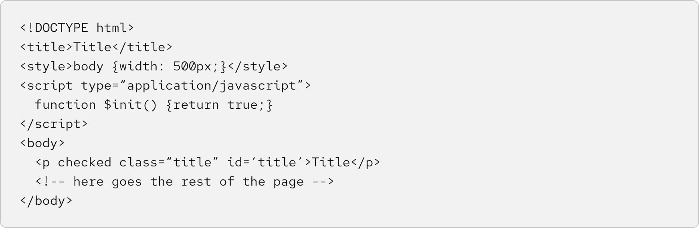

## Overview

{{ tagName | getElementDescription }}

<uxdot-example width-adjustment="872px">
  
</uxdot-example>



## Sample element

<rh-code-block>

</rh-code-block>

## When to use

  - When you need to highlight a block of code while maintaining the formatting


