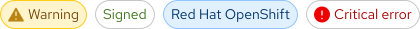

## Overview

{{ tagName | getElementDescription }}

<uxdot-example width-adjustment="404px">
  
</uxdot-example>



## Sample element
<rh-tag color="red">Filled</rh-tag>
<rh-tag variant="outline" color="red">Outlined</rh-tag>
<rh-tag variant="desaturated">Desaturated</rh-tag>

## When to use
  - Categorize content
  - Add context or clarity to elements
  - Indicate status


