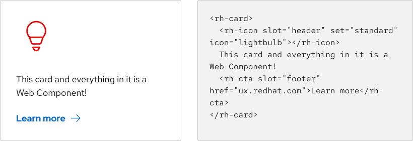

<section class="intro">

## We create Red Hat digital experiences

Red Hat teams work across the world in a range of disciplines, from UX research 
and digital design to web development and content strategy. The Red Hat Design 
System (RHDS) for digital experiences allows designers and developers to build 
branded user experiences consistently and to make every digital interaction with 
Red Hat reflect our core brand traits: open, authentic, helpful, and brave.

</section>

## We’re guided by our core principles

  <rh-card>
    <rh-icon slot="header" set="standard" icon="community-people"></rh-icon>
    <h3 slot="header">User-centered</h3>
    
We focus on the people for which we are designing, and this advocacy extends beyond the customer to include the experience of Red Hat associates.

  </rh-card>
  <rh-card>
    <rh-icon slot="header" set="standard" icon="handshake"></rh-icon>
    <h3 slot="header">Co-creative</h3>
    
UX design is a team sport. Many people both within Red Hat, and with outside feedback, contribute to creating the user experience.

  </rh-card>
  <rh-card>
    <rh-icon slot="header" set="standard" icon="architect"></rh-icon>
    <h3 slot="header">Holistic</h3>
    
We consider the end-to-end experience, not just a single moment, single website, service encounter, or journey stage.

  </rh-card>
  <rh-card>
    <rh-icon slot="header" set="standard" icon="management-and-automation"></rh-icon>
    <h3 slot="header">Orchestrated</h3>
    
Processes, tools, and roles must be aligned to deliver and maintain an optimal Red Hat digital experience

  </rh-card>

## We rely on our foundations

The Red Hat brand has a strong voice. To make our design system feel like Red 
Hat, we use foundations like [color](/foundations/color/), 
[space](/foundations/spacing/), and [typography](/foundations/typography/) to 
enhance our elements and patterns and to align them to Red Hat’s [design 
language standards](https://www.redhat.com/en/about/brand/standards).

### Red Hat brand standards

Red Hat brand standards are the source code for our identity. They govern how we 
look and sound in all types of media. We follow brand standards to unify Red Hat 
digital experiences and stay up-to-date with our brand as it grows, improves, 
and adapts to meet new challenges.

<rh-cta href="https://www.redhat.com/en/about/brand/standards">Learn about the Red Hat brand</rh-cta>

<uxdot-example variant="full" no-border alignment="left" width-adjustment="1140px">
 
</uxdot-example>

### Design tokens

Our foundations are implemented through design tokens, which are used in lieu of 
hard-coded values for color, text attributes, spacing, and more. Tokens help us 
keep Web Components flexible and scalable. Additionally, semantic token names 
help us assign consistent meanings that correspond with foundational guidelines.

<rh-cta href="/tokens/">Learn about our tokens</rh-cta>

<uxdot-example color-palette="lightest" width-adjustment="807px">
 
</uxdot-example>

## We build Web Components

Our team is building an open source, Web Component-driven development system to 
build scalable UI elements and patterns. By using Web Components, it allows 
developers to use our code with encapsulated functionality and styles in any 
framework or platform.

<rh-cta href="/get-started/developers/#about-web-components">Learn about the benefits of Web Components</rh-cta>

<uxdot-example width-adjustment="820px">
 
</uxdot-example>

## We look for opportunities to align

### PatternFly

In addition to RHDS, Red Hat uses PatternFly, an open source design system, for 
its products. We share design and foundations when possible by collaborating 
with the PatternFly team. When building a new component or updating an existing 
component, PatternFly is always our first source of inspiration. 

By sharing ideas between the PatternFly and RHDS teams, we create a design 
language across all of Red Hat, for each stage of the customer lifecycle.

<rh-cta href="https://www.patternfly.org/">Visit PatternFly</rh-cta>

### PatternFly Elements

The PatternFly Elements (PFE) project leverages the PatternFly design system and 
some code elements to create an accessible and open source Web Component 
library. 

Like RHDS Web Components, PFE Web Components not only work in any application 
framework, they are evergreen. This means that the components themselves can be 
upgraded easily, allowing for consistency, scalability, and flexibility.

<rh-cta href="https://patternflyelements.org/">Visit PatternFly Elements</rh-cta>

<uxdot-example width-adjustment="558px">

</uxdot-example>

## We provide support

Whether you are implementing an element or pattern or contributing to the design 
system, the RHDS team is here to help. Our [Design/code status][dcs] table shows 
where everything is available, including whether they’ve been added to the Red 
Hat Shared Libraries, which makes our Web Components ready for use in Drupal, 
React, plain HTML, and other frameworks. We also have multiple ways for you to 
reach our team about bugs, feature requests, and more.

<rh-cta href="/support/">Get support</rh-cta>

<uxdot-feedback>
  <h2>Release Notes</h2>
  
To see what foundations, tokens, elements, or patterns have been released recently, check out <a href="/about/release-notes">our release notes</a>.

</uxdot-feedback>

[dcs]: /design-code-status/
