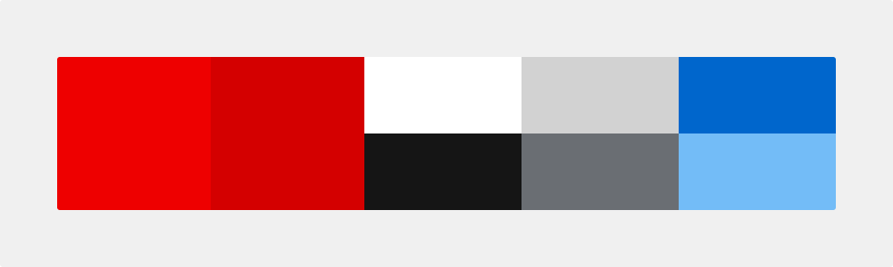
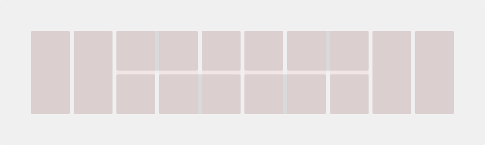
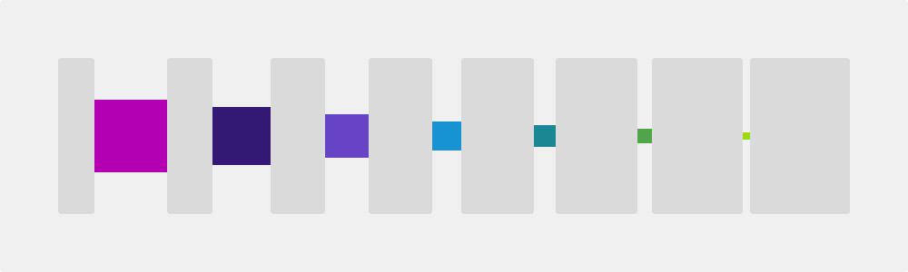
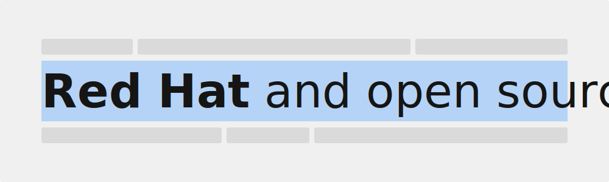

<link rel="stylesheet"
      href="/assets/packages/@rhds/elements/elements/rh-tile/rh-tile-lightdom.css"
      data-helmet>

<section aria-labelledby="overview">

  ## Overview

  Foundations are the visual and structural elements of our design system.
  Foundations were created as the building blocks of all user interface elements.
  Foundations should be used as blueprints that all components and layouts are
  created from.

  

    <rh-tile>
      
      <h3 slot="headline"><a href="../foundations/color">Color</a></h3>
      
Unifies our brand while bringing accessibility and consistency to our digital experiences

    </rh-tile>
    <rh-tile>
      
      <h3 slot="headline"><a href="../foundations/grid">Grid</a></h3>
      
Provides guidance and structure when positioning elements and components in a layout

    </rh-tile>
    <rh-tile>
      
      <h3 slot="headline"><a href="../foundations/spacing">Spacing</a></h3>
      
Defines fixed amounts of space between elements and makes it easy to maintain consistency

    </rh-tile>
    <rh-tile>
      
      <h3 slot="headline"><a href="../foundations/typography">Typography</a></h3>
      
A system of fonts that creates hierarchies and helps guide a user through an experience

    </rh-tile>
  

</section>

## Make a request

To request a new foundation or if updates need to be made to an existing
foundation, [contact us](mailto:digital-design-system@redhat.com).


