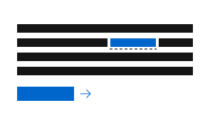

<link rel="stylesheet"
      href="/assets/packages/@rhds/elements/elements/rh-tile/rh-tile-lightdom.css"
      data-helmet>

<h2 class="large-red-text">Consistent interactions help guide our users through complex tasks.</h2>

They help ensure that anything interactive is accessible, communicative, and intuitive.

## Types of interactions

Interactions are foundational to how our users engage with Red Hat digital experiences.

<nav id="interactions-nav"
     class="grid sm-three-columns"
     aria-label="Interaction types">
    <rh-tile compact>
      
      <h3 slot="headline"><a href="/foundations/interactions/links">Links</a></h3>
      Text that sends users to another destination
    </rh-tile>
</nav>