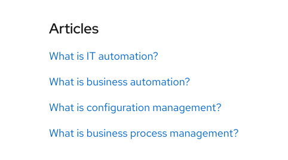
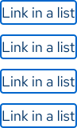

<link rel="stylesheet" 
      href="/path/to/rh-code-block/rh-code-block-lightdom.css"
      data-helmet>

<link rel="stylesheet"
      href="/assets/packages/@rhds/elements/elements/rh-table/rh-table-lightdom.css"
      data-helmet>

## Types of links

Links are interactive elements that connect users to another page or page section. Outside of navigation elements, most links will appear as one of the following types:

- **Inline links** - appear within a sentence or paragraph of text
- **Links in a list** - may be [accompanied by an icon][linkwithicon]
- **[Calls to action][ctas]** - styled links that call attention to important actions

## Inline links

<uxdot-pattern src="./inline-link-demo.html" no-code-tabs="">
</uxdot-pattern>

## Interaction states

To improve link affordance in alignment with our brand standards, the styles in this section should apply to all inline links, visited and unvisited, in both light and dark schemes, unless noted as an exception.

<rh-alert state="info">
  <h4 slot="header">Helpful tip</h4>
  
The <a href="/get-started/designers/figma-library#use-libraries">Red Hat Design System Figma library</a> contains link styles for easy formatting. However, Figma’s type settings do not currently include dashed underlines, so the style outlined below is being approximated by a dotted underline.

</rh-alert>

### Default

Inline text links that may appear alongside non-link text (e.g., within body paragraphs and list items) should be styled like the following:

<rh-table>
  <table>
    <colgroup>
      <col>
      <col>
      <col>
    </colgroup>
    <thead>
      <tr>
        <th scope="col">Property</th>
        <th scope="col">Light scheme<rh-sort-button></rh-sort-button>
        </th>
        <th scope="col">Dark scheme<rh-sort-button></rh-sort-button>
        </th>
      </tr>
    </thead>
    <tbody>
      <tr>
        <td>Color - text</td>
        <td><code>--rh-color-interactive-primary-default</code></td>
        <td><code>--rh-color-interactive-primary-default</code></td>
      </tr>
      <tr>
        <td>Underline - style</td>
        <td><code>text-decoration-style: dashed;</code></td>
        <td><code>text-decoration-style: dashed;</code></td>
      </tr>
      <tr>
        <td>Underline - thickness</td>
        <td>1px</td>
        <td>1px</td>
      </tr>
      <tr>
        <td>Underline - color</td>
        <td><code>gray-50</code></td>
        <td><code>gray-40</code></td>
      </tr>
      <tr>
        <td>Underline - offset</td>
        <td>5px</td>
        <td>5px</td>
      </tr>
    </tbody>
  </table>
</rh-table>

### Hover

When these links receive a mouse cursor hover, link colors and underline styles are updated to the following:

<rh-table>
  <table>
    <colgroup>
      <col>
      <col>
      <col>
    </colgroup>
    <thead>
      <tr>
        <th scope="col">Property</th>
        <th scope="col">Light scheme</th>
        <th scope="col">Dark scheme</th>
      </tr>
    </thead>
    <tbody>
      <tr>
        <td>Color - text</td>
        <td><code>--rh-color-interactive-primary-hover</code></td>
        <td><code>--rh-color-interactive-primary-hover</code></td>
      </tr>
      <tr>
        <td>Underline - color</td>
        <td><code>--rh-color-interactive-primary-hover</code></td>
        <td><code>--rh-color-interactive-primary-hover</code></td>
      </tr>
      <tr>
        <td>Underline - offset</td>
        <td>6px</td>
        <td>6px</td>
      </tr>
    </tbody>
  </table>
</rh-table>

### Visited state

Visited links will change colors to one of our [interactive visited tokens][interactivevisitedtokens].

## Underlining

The following elements are exempt from underlining requirements and should not have the aforementioned underline styles applied to them by default.

### Exceptions

  <figure class="underline-exception">
    <uxdot-example color-palette="lighter" width-adjustment="482px" slot="image">
      
    </uxdot-example>
    <figcaption>
        <rh-icon set="ui" size="md" icon="close-circle-fill" defer-hydration=""></rh-icon>Don't underline
        
Do not underline links within visually distinct navigation groupings like menus and breadcrumbs.

    </figcaption>
  </figure>

  <figure class="underline-exception">
    <uxdot-example color-palette="lightest" width-adjustment="482px" slot="image">
      
    </uxdot-example>
    <figcaption>
        <rh-icon set="ui" size="md" icon="close-circle-fill" defer-hydration=""></rh-icon>Don't underline
      
Do not underline links accompanied by visual cues (e.g., call to action arrows) that indicate their interactivity.

    </figcaption>
  </figure>

  <figure class="underline-exception">
    <uxdot-example color-palette="lightest" width-adjustment="482px" slot="image">
      
    </uxdot-example>
    <figcaption>
        <rh-icon set="ui" size="md" icon="close-circle-fill" defer-hydration=""></rh-icon>Don't underline
      
Do not underline links that will not appear alongside non-link text like a list of links within a card.

    </figcpation>
  </figure>

### Example CSS

Developers can use the following CSS as a starting point for link underlining:

- In practice, you will probably want to use a more specific selector than `:is(p, ul, ol, dl) a`, because this example selector applies to all links in paragraphs or lists on a page.
- This example adds a `max()` function to the `text-underline-offset` property, allowing this value to grow proportionally at large font sizes.
- As of this writing, Safari has some issues with the `text-decoration` shorthand property, so we separated it out into its component options `(-color, -line, -style, and -thickness)`.

<rh-code-block>
  
</rh-code-block>

## Behavior

### Opening links in new windows

At Red Hat, we prefer to [keep the user in control](/accessibility/design/#user-control) of their own experience. Therefore, avoid forcing links to open in new windows or tabs, except under [very specific circumstances](/accessibility/design/#opening-links-in-new-windows).

<rh-alert state="info">
  <h4 slot="header">Helpful tip</h4>
  
Pointing an external link to another domain is <a href="/accessibility/design/#opening-links-in-new-windows">not reason alone</a> to open it in a new window or tab.

</rh-alert>

## Accessibility

### Keyboard interactions

A user should have the ability to navigate to and interact with links using their keyboard.

<rh-table>
  <table>
    <colgroup>
      <col>
      <col>
    </colgroup>
    <thead>
      <tr>
        <th scope="col">Key</th>
        <th scope="col">Result</th>
      </tr>
    </thead>
    <tbody>
      <tr>
        <td><kbd>Tab</kbd></td>
        <td>Moves focus to the next interactive element (for example, from link to link)</td>
      </tr>
      <tr>
        <td><kbd>Shift</kbd> + <kbd>Tab</kbd></td>
        <td>Moves focus to the previous interactive element (for example, from a call to action to an inline link like in the example below)</td>
      </tr>
      <tr>
        <td><kbd>Enter</kbd></td>
        <td>Selects a link</td>
      </tr>
    </tbody>
  </table>
</rh-table>

### Tab order

When the Tab key is pressed repeatedly, the focus highlights links in order, from left to right and top to bottom.

<uxdot-example color-palette="lightest" width-adjustment="606px" slot="image">
  
</uxdot-example>

<uxdot-example color-palette="lightest" width-adjustment="93px" slot="image">
  
</uxdot-example>

## Best practices

### Link text clarity

  <uxdot-best-practice variant="do">
    <uxdot-example color-palette="lightest" width-adjustment="482px" slot="image">
      
    </uxdot-example>
    
Use descriptive language to give users a clear idea of where a link will take them.

  </uxdot-best-practice>

  <uxdot-best-practice variant="dont">
    <uxdot-example color-palette="lightest" width-adjustment="482px" slot="image">
      
    </uxdot-example>
    
Do not use ambiguous phrases or a full website URL in body text.

  </uxdot-best-practice>

<rh-cta href="/accessibility/content/#link-text">Writing accessible link text</rh-cta>

### Long links

  <uxdot-best-practice variant="do">
    <uxdot-example color-palette="lightest" width-adjustment="482px" slot="image">
      
    </uxdot-example>
    
Try to keep link text as brief as possible.

  </uxdot-best-practice>

  <uxdot-best-practice variant="dont">
    <uxdot-example color-palette="lightest" width-adjustment="482px" slot="image">
      
    </uxdot-example>
    
<a href="/accessibility/content/#avoid-the-following-when-creating-links">Do not link</a> very long strings of text (including long URLs).

  </uxdot-best-practice>

### Buttons

  <uxdot-best-practice variant="do">
    <uxdot-example color-palette="lightest" width-adjustment="482px" slot="image">
      
    </uxdot-example>
    
<a href="/elements/button/">Buttons</a> have different use cases and should only be used for actions.

  </uxdot-best-practice>

  <uxdot-best-practice variant="dont">
    <uxdot-example color-palette="lightest" width-adjustment="482px" slot="image">
      
    </uxdot-example>
    
Do not use buttons as links.

  </uxdot-best-practice>

[linkwithicon]: /patterns/link-with-icon/
[ctas]: /elements/call-to-action/
[interactivevisitedtokens]: /tokens/color/#color-interactive-primary-visited
[redhat]: https://www.redhat.com
