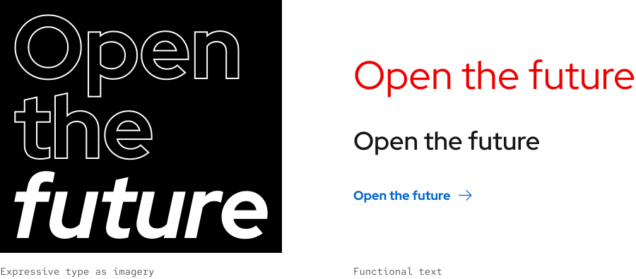
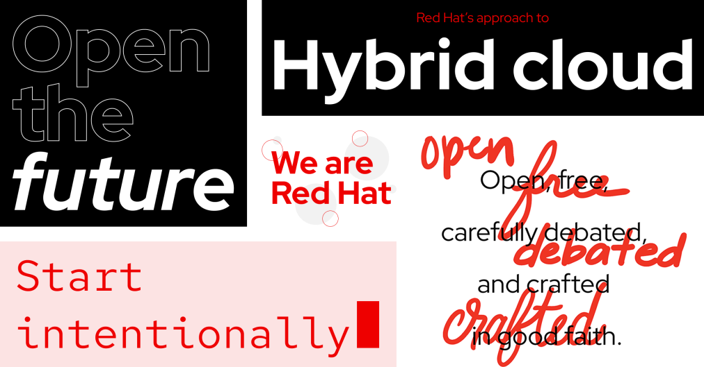
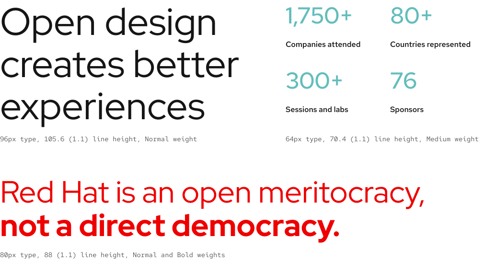
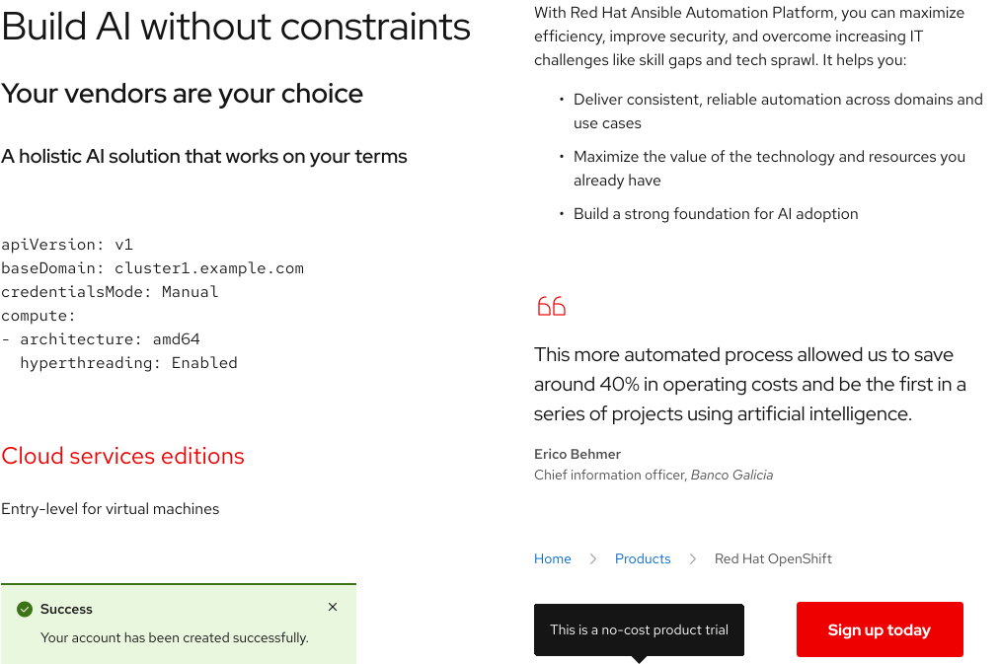
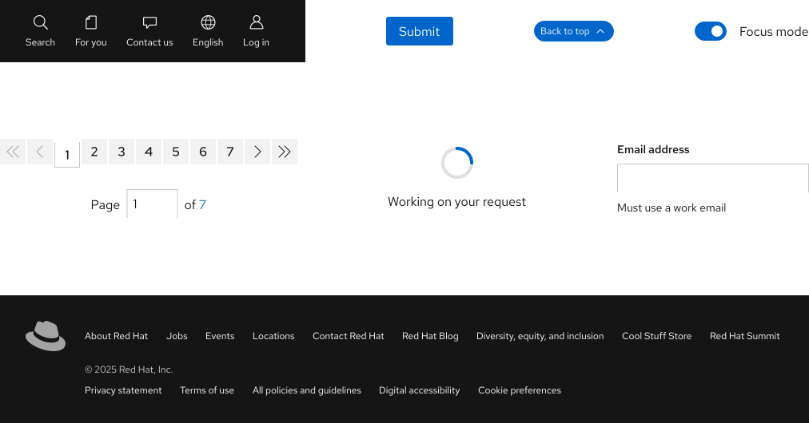

## Overview

We use 3 categories of type: Expressive, Editorial, and Utility. Each category is designed for a specific use case.

## Expressive type

Expressive type bridges the gap between our branding and how we use type on the web. It allows for flexibility where type can be used as imagery, use extended weights, and be set in larger sizes. Due to this freeform nature, not only should Expressive type be used very sparingly, <strong>but also very strategically</strong>.

### Type as imagery

Expressive type can be used as imagery if using other assets is not an option or not appropriate. It should feel more like decoration rather than functional text.

<uxdot-example width-adjustment="900px" color-palette="lightest">
  
</uxdot-example>

### Extended weights and other fonts

<strong>Expressive type relies on creative direction.</strong> It must represent a specific campaign, event, theme, etc. Extended weights and other fonts provide emphasis and help tell a cohesive story when used in combination with Editorial and Utility text styles.

<uxdot-example width-adjustment="1012px" color-palette="lightest">
  
</uxdot-example>

### Extra large headings

Expressive type allows for the <strong>extremely limited</strong> use of extra large heading sizes, but not every heading needs to be larger than the sizes in the [scale][scaleandrhythm]. Creative direction or the goal of the page or experience should dictate whether or not heading sizes need to be larger. Follow these best practices as well.

- Use lots of white space around headings
- Limit the number of words or choose a smaller heading size
- Maintain a consistent size if extra large headings are used more than once per page or experience
- Use red or other colors that are part of a theme like Summit
- Use the bold weight sparingly
- Line height reduces to 110% or 1.1x the font size 

<uxdot-example width-adjustment="1012px" color-palette="lightest">
  
</uxdot-example>

## Editorial type

Editorial type is text written as prose that is readable at both small and large sizes. It can be short- or long-form depending on where it is used, but is subject to change based on the system or user action. Editorial type is very flexible and covers a wide range of use cases, so <strong>use it as the default</strong> to start.

Editorial type includes the following styles.

- Headings
- Body/code text
- Lists
- Titles
- Quotes
- Call to action text 

<uxdot-example width-adjustment="1012px" color-palette="lightest">
  
</uxdot-example>

## Utility type

Utility type is functional text that is readable at small sizes and helps users complete tasks. It is less subject to change because it is written to be instructional, not prose. Utility type can be flexible, but it also needs to be short and not exceed more than a few words. Use it for any other use cases that Editorial type cannot cover.

Utility type includes the following styles.

- Badge/tag text
- Button text
- Form fields/labels
- Input/control text
- Legal text
- Numbers

<uxdot-example width-adjustment="1012px" color-palette="lightest">
  
</uxdot-example>

<uxdot-feedback>
  <h2>Foundations</h2>
  
To learn how to use our other foundations in your designs, visit the <a href="/foundations">foundations</a> section.

</uxdot-feedback>

[scaleandrhythm]: ../typography/scale-and-rhythm