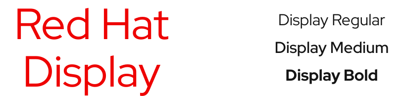
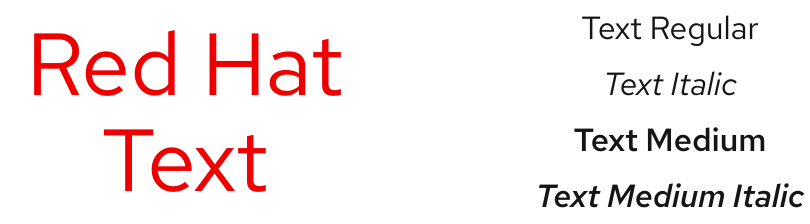
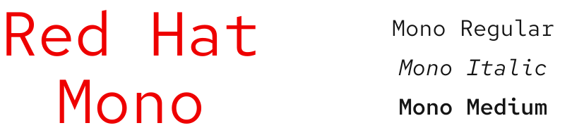
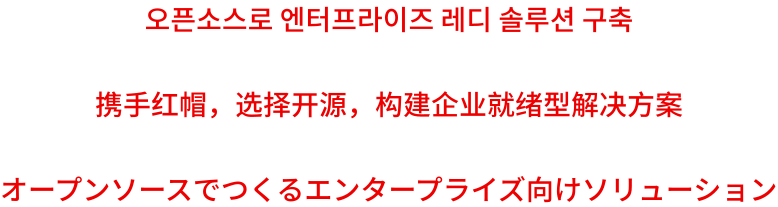

<link rel="stylesheet"
      href="/assets/packages/@rhds/elements/elements/rh-table/rh-table-lightdom.css"
      data-helmet>

## Overview

The Red Hat font family includes 3 fonts: [Red Hat Display][rhdisplay], [Red Hat Text][rhtext], and [Red Hat Mono][rhmono]. Their design is based on who we are: real people with big ideas creating platforms that power technology innovation.

To learn more about the Red Hat font family, go to the [Brand standards][brandstandards] website.

## Design tokens

Design tokens represent our design decisions as code. They are also how we track changes made to the design system. If a text style is changed, that change propagates across all websites and experiences that use tokens.

To see a list of tokens, including Noto, go to the [Typography tokens][typographytokens] page.

## Red Hat Display

Red Hat Display is our default font. Use it for headings to grab attention and establish hierarchy. Its letterforms reinforce our [tone of voice][tone] and reflect our technical and engineering expertise. Meanwhile, human touches disrupt the rigidity to represent our people and call back to the history of our brand.

Use regular, medium, or bold weights. Other weights can be used for [Expressive type][expressivetype] only.

<uxdot-example width-adjustment="810px" color-palette="lightest">
  
</uxdot-example>

## Red Hat Text

Red Hat Text takes all of the personality from Display and optimizes it for more demanding applications like paragraph text or text at small sizes.

Use the medium weight and italics for emphasis. Other weights can be used for [Expressive type][expressivetype] only.

<uxdot-example width-adjustment="810px" color-palette="lightest">
  
</uxdot-example>

## Red Hat Mono

Red Hat Mono was created to distinguish code from natural-language text. Use it to demonstrate code snippets in communications and interfaces or as a stylistic approach for more technical audiences.

Use the medium weight and italics for emphasis. Other weights can be used for [Expressive type][expressivetype] only.

<uxdot-example width-adjustment="810px" color-palette="lightest">
  
</uxdot-example>

## Non-Latin fonts

Noto is a set of international fonts developed by Google, Monotype, Adobe, and leading experts from around the world. All Noto fonts are licensed under the Open Font License. The simple and clean design makes it a good counterpart to the Red Hat font family.

<uxdot-example width-adjustment="778px" color-palette="lightest">
  
</uxdot-example>

## Download fonts

### Red Hat

  <rh-card>
    
    <rh-cta>
        <a href="https://fonts.google.com/?query=Red+Hat">Google Fonts</a>
    </rh-cta>
  </rh-card>
  <rh-card>
    
    <rh-cta>
        <a href="https://github.com/RedHatOfficial/RedHatFont">GitHub</a>
    </rh-cta>
  </rh-card>

### Noto Sans

  <rh-card>
    
    <rh-cta>
        <a href="https://fonts.google.com/noto/specimen/Noto+Sans">Google Fonts</a>
    </rh-cta>
  </rh-card>

<uxdot-feedback>
  <h2>Foundations</h2>
  
To learn how to use our other foundations in your designs, visit the <a href="/foundations">foundations</a> section.

</uxdot-feedback>

[rhdisplay]: #red-hat-display
[rhtext]: #red-hat-text
[rhmono]: #red-hat-mono
[brandstandards]: https://www.redhat.com/en/about/brand/standards
[typographytokens]: /tokens/font/
[tone]: https://www.redhat.com/en/about/brand/standards/personality#how-we-sound
[expressivetype]: /foundations/typography/choosing-type/#expressive-type

