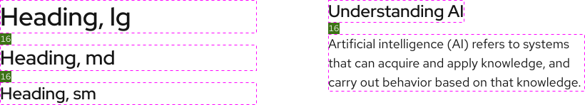
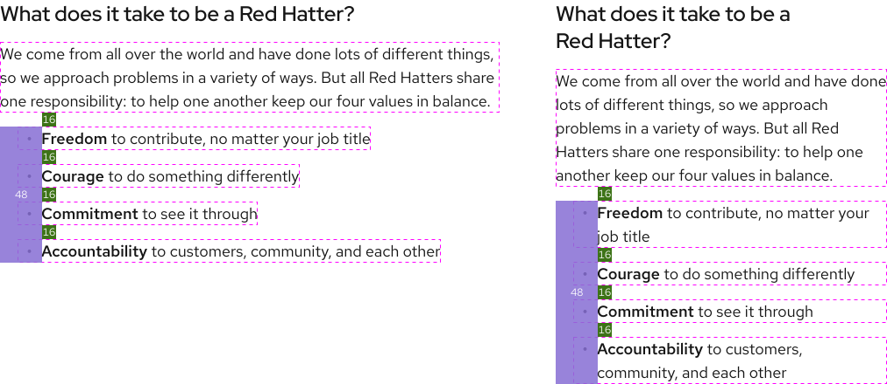
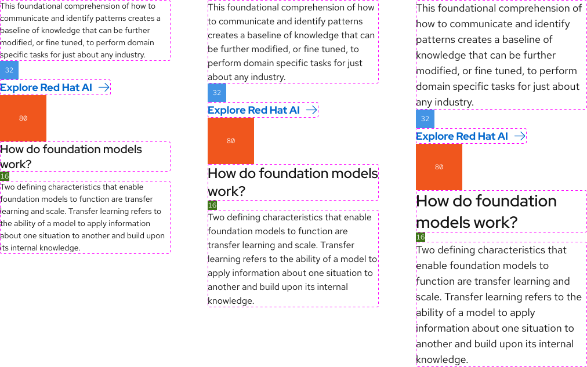
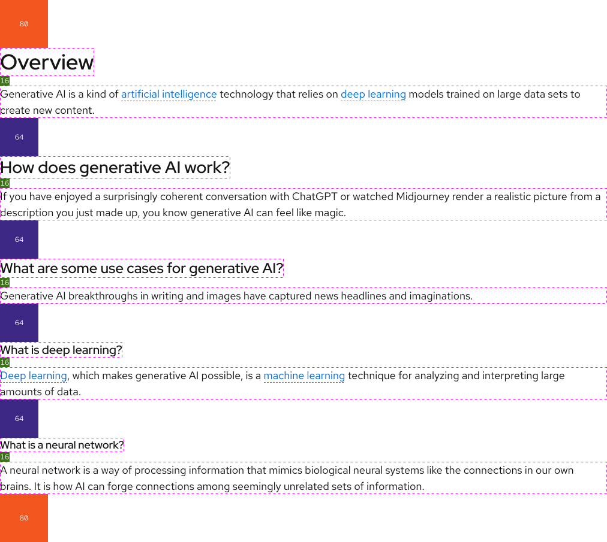

<link data-helmet rel="stylesheet" href="/assets/packages/@rhds/elements/elements/rh-table/rh-table-lightdom.css">

## Overview

Our type scale features a range of text sizes and weights designed to support lots of content and user needs. Use tokens to implement these styles.

<rh-cta href="/tokens/font/">View typography tokens</rh-cta>

### Base text size

We use a base text size of 16px or `1.0rem`.

## Desktop scale

### Extra small headings

Use extra small headings inside small elements or for other use cases. Weights for these headings should not be changed.

<rh-table>

| Name  | Font family            | Weight       | Size           | Line height (1.3) |
| ----- | ---------------------- | ------------ | -------------- | ----------------- |
| 3xs   | Display                | Medium (500) | 16 (1.0rem)    | 20.8              |
| 2xs   | Display                | Medium (500) | 18 (1.125rem)  | 23.4              |

</rh-table>

### Standard headings

These are our standard h1 - h6 heading sizes. Weights for these headings should not be changed.

<rh-table>

| Name  | Font family            | Weight        | Size         | Line height (1.3) |
| ----- | ---------------------- | ------------- | ------------ | ----------------- |
| xs    | Display                | Medium (500)  | 20 (1.25rem) | 26                |
| sm    | Display                | Medium (500)  | 24 (1.5rem)  | 31.2              |
| md    | Display                | Medium (500)  | 28 (1.75rem) | 36.4              |
| lg    | Display                | Medium (500)  | 36 (2.25rem) | 46.8              |
| xl    | Display                | Regular (400) | 40 (2.5rem)  | 52                |
| 2xl   | Display                | Regular (400) | 48 (3.0 rem) | 62.4              |

</rh-table>

### Expressive headings

To learn more about how to use expressive headings, go to the [Choosing type][choosingtype] page.

<rh-table>

| Name  | Font family            | Weight   | Size        | Line height (1.1) |
| ----- | ---------------------- | -------- | ----------- | ----------------- |
| 3xl   | Display, Text, Mono    | Multiple | 64 (4.0rem) | 70.4              |
| 4xl   | Display, Text, Mono    | Multiple | 80 (5.0rem) | 88                |
| 5xl   | Display, Text, Mono    | Multiple | 96 (6.0rem) | 105.6             |

</rh-table>

### Body text and lists

Body text and lists can use the medium weight and italics for emphasis, but never use the bold weight.

<rh-table>

| Name  | Font family | Weight  | Size          | Line height (1.5) |
| ----- | ----------- | ------- | ------------- | ----------------- |
| xs    | Text        | Regular | 12 (0.75rem)  | 18                |
| sm    | Text        | Regular | 14 (0.875rem) | 21                |
| md    | Text        | Regular | 16 (1.0rem)   | 24                |
| lg    | Text        | Regular | 18 (1.125rem) | 27                |
| xl    | Text        | Regular | 20 (1.25rem)  | 30                |
| 2xl   | Text        | Regular | 24 (1.5rem)   | 36                |

</rh-table>

### Code

Code text may use the medium weight and italics for emphasis if necessary, but never use the bold weight.

<rh-table>

| Name  | Font family | Weight  | Size          | Line height (1.5) |
| ----- | ----------- | ------- | ------------- | ----------------- |
| xs    | Mono        | Regular | 12 (0.75rem)  | 18                |
| sm    | Mono        | Regular | 14 (0.875rem) | 21                |
| md    | Mono        | Regular | 16 (1.0rem)   | 24                |
| lg    | Mono        | Regular | 18 (1.125rem) | 27                |
| xl    | Mono        | Regular | 20 (1.25rem)  | 30                |
| 2xl   | Mono        | Regular | 24 (1.5rem)   | 36                |

</rh-table>

### Call to action

<rh-table>

| Name  | Font family | Weight  | Size          | Line height (1.5) |
| ----- | ----------- | ------- | ------------- | ----------------- |
| sm    | Display     | Bold    | 16 (1.0rem)   | 24                |
| lg    | Display     | Bold    | 18 (1.125rem) | 27                |

</rh-table>

### Title

<rh-table>

| Name  | Font family | Weight  | Size         | Line height (1.5) |
| ----- | ----------- | ------- | ------------ | ----------------- |
| sm    | Text        | Regular | 16 (1.0rem)  | 24                |
| lg    | Text        | Regular | 20 (1.25rem) | 30                |

</rh-table>

### Quote

The bold weight may be used for emphasis if absolutely necessary.

<rh-table>

| Name  | Font family | Weight  | Size         | Line height (1.5) |
| ----- | ----------- | ------- | ------------ | ----------------- |
| sm    | Display     | Regular | 20 (1.25rem) | 30                |
| lg    | Display     | Regular | 28 (1.75rem) | 42                |

</rh-table>

## Mobile scale

The mobile scale takes effect when the viewport size is less than 768px.

### Extra small headings

Extra small heading sizes do not get smaller.

### Standard headings

<rh-table>

| Name | Font family  | Weight        | Size                              | Line height (1.3) |
| ---- | ------------ | ------------- | --------------------------------- | ----------------- |
| 2xl  | Display      | Regular (400) | <s>48 (3.0rem)</s> Reduces to 35  | <s>62.4</s> 45.5  |
| xl   | Display      | Regular (400) | <s>40 (2.5rem)</s> Reduces to 29  | <s>52</s> 37.7    |
| lg   | Display      | Medium (500)  | <s>36 (2.25rem)</s> Reduces to 26 | <s>46.8</s> 33.8  |
| md   | Display      | Medium (500)  | <s>28 (1.75rem)</s> Reduces to 24 | <s>36.4</s> 31.2  |
| sm   | Display      | Medium (500)  | <s>24 (1.5rem)</s> Reduces to 20  | <s>31.2</s> 26    |
| xs   | Display      | Medium (500)  | <s>20 (1.25rem)</s> Reduces to 18 | <s>26</s> 23.4    |

</rh-table>

### Expressive headings

All expressive heading sizes reduce to 48px.

<rh-table>

| Name | Font family  | Weight   | Size                              | Line height (1.1) |
| ---- | ------------ | -------- | --------------------------------- | ----------------- |
| 3xl  | Display      | Multiple | <s>64 (4.0rem)</s> Reduces to 48  | <s>70.4</s> 52.8  |
| 4xl  | Display      | Multiple | <s>80 (5.0rem)</s> Reduces to 48  | <s>88</s> 52.8    |
| 5xl  | Display      | Multiple | <s>96 (6.0rem)</s> Reduces to 48  | <s>105.6</s> 52.8 |

</rh-table>

### Body text and lists

Body text and list sizes that are 16px and below do not get smaller.

<rh-table>

| Name | Font family | Weight        | Size                               | Line height (1.5) |
| ---- | ----------- | ------------- | ---------------------------------- | ----------------- |
| lg   | Text        | Regular       | <s>18 (1.125rem)</s> Reduces to 16 | <s>27</s> 24      |
| xl   | Text        | Regular       | <s>20 (1.25rem)</s> Reduces to 18  | <s>30</s> 27      |
| 2xl  | Text        | Regular       | <s>24 (1.5rem)</s> Reduces to 20   | <s>36</s> 30      |

</rh-table>

### Code

Code sizes that are 16px and below do not get smaller.

<rh-table>

| Name | Font family | Weight        | Size                               | Line height (1.5) |
| ---- | ----------- | ------------- | ---------------------------------- | ----------------- |
| lg   | Mono        | Regular       | <s>18 (1.125rem)</s> Reduces to 16 | <s>27</s> 24      |
| xl   | Mono        | Regular       | <s>20 (1.25rem)</s> Reduces to 18  | <s>30</s> 27      |
| 2xl  | Mono        | Regular       | <s>24 (1.5rem)</s> Reduces to 20   | <s>36</s> 30      |

</rh-table>

### Call to action

Call to action sizes do not get smaller.

### Title

The `Title, sm` size does not get smaller.

<rh-table>

| Name | Font family | Weight        | Size                               | Line height (1.5) |
| ---- | ----------- | ------------- | ---------------------------------- | ----------------- |
| lg   | Text        | Regular       | <s>20 (1.25rem)</s> Reduces to 18  | <s>30</s> 27      |

</rh-table>

### Quote

<rh-table>

| Name | Font family | Weight        | Size                              | Line height (1.5) |
| ---- | ----------- | ------------- | --------------------------------- | ----------------- |
| sm   | Display     | Regular       | <s>20 (1.25rem)</s> Reduces to 18 | <s>30</s> 27      |
| lg   | Display     | Regular       | <s>28 (1.75rem)</s> Reduces to 24 | <s>42</s> 36      |

</rh-table>

## Vertical rhythm

### Headings and paragraphs

Use the `--rh-space-lg` token in between stacked headings and in between headings and body text.

<uxdot-example width-adjustment="820px" color-palette="lightest">
  
</uxdot-example>

### Lists

Use the following specs for lists.

- Use the `--rh-space-lg` token on top of a list and in between each bullet
- Use the `--rh-space-3xl` token for left indentation
- All padding specs are the same on mobile breakpoints

<uxdot-example width-adjustment="1012px" color-palette="lightest">
  
</uxdot-example>

### Margins

There are different margin specs depending on how text styles are grouped.

- In general, blocks of content use the `--rh-space-5xl` token on the top and bottom
- Blocks of content with subsections use the `--rh-space-4xl` token in between

<uxdot-example width-adjustment="1012px" color-palette="lightest">
  
</uxdot-example>

<uxdot-example width-adjustment="1012px" color-palette="lightest">
  
</uxdot-example>

<uxdot-feedback>
  <h2>Foundations</h2>
  
To learn how to use our other foundations in your designs, visit the <a href="/foundations">foundations</a> section.

</uxdot-feedback>

[choosingtype]: /foundations/typography/choosing-type
