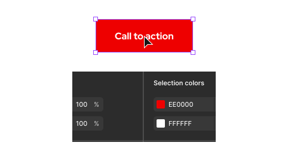

<link rel="stylesheet"
      href="/assets/packages/@rhds/elements/elements/rh-table/rh-table-lightdom.css"
      data-helmet>

## Introduction

### Philosophy

Using Figma variables and styles is an evolution from **painting pictures** to **building systems**. It reframes design as a shared language between disciplines, where we communicate with design tokens that carry intent, not just appearance.

This philosophical shift redefines our role as designers from creators of static visuals to architects of dynamic coherent language that **bridges design and engineering**.

## Benefits

Figma variables and styles have established new best practices around how design systems should be structured and managed. These best practices result in the following benefits and impacts.

<rh-table>

  | Benefit           | Impact                                                                                                                                                                                 |
  | ------------------| ---------------------------------------------------------------------------------------------------------------------------------------------------------------------------------------|
  | Adaptability      | <ul><li>Existing components and patterns can scale across platforms, devices, etc. without being rebuilt</li></ul>                                                                     |
  | Consistency       | <ul><li>Centralizing values ensures that every component and pattern adheres to the same rules</li></ul>                                                                               |
  | Developer handoff | <ul><li>Clear and consistent language is created between designers and developers as variable and style names correspond to design tokens used in code</li></ul>                       |
  | Efficiency        | <ul><li>Speeds up the design process by providing a predefined set of styles</li></ul>                                                                                                 |
  | Governance        | <ul><li>A tiered system (primitive, semantic, etc.) controls which decisions are locked down and which are flexible</li></ul>                                                          |
  | Scalability       | <ul><li>Easy to update and maintain designs across projects of any size</li></ul>                                                                                                      |
  | Theming           | <ul><li>New themes, brands, or densities can be added as modes with minimal effort</li><li>Modes ensure that components and patterns automatically adopt the correct styling</li></ul> |

</rh-table>

## Terminology

### What are design tokens?

Design tokens are the **single source of truth** that represent the small repeatable design choices that construct our visual language. A token is a concept, a named decision, whereas a Figma variable is its direct raw implementation and a Figma style is a bundle of tokens applied to a specific property.

To learn more, go to the [Tokens](/tokens/) section.

<uxdot-example no-border color-palette="lighter">
  
</uxdot-example>

### What are Figma variables

Figma variables are reusable values that can be applied to various design properties. Instead of manually changing individual elements, we can update a variable and every element linked to it will automatically change. This is useful for managing design tokens, maintaining consistency, creating different themes, and more.

The following variable types are included in the RHDS library.

  

    <ul>
      <li>Border</li>
      <li>Breakpoint</li>
      <li>Icon</li>
      <li>Opacity</li>
      <li>Typography</li>
    </ul>
  

  

    <ul>
      <li>Box shadow</li>
      <li>Color</li>
      <li>Length</li>
      <li>Space</li>
    </ul>
  

<uxdot-example no-border color-palette="lighter">
  
</uxdot-example>

### What are Figma styles?

Figma styles are reusable bundles of tokens created for specific properties. Think of them as a shortcut for applying a consistent look to components. When we update a style, every object using that style will update across your files, ensuring visual consistency.

The following style types are included in the RHDS library.

  - Colors (like gradients)
  - Text (bundled tokens like font family, line height, size, weight, and more)
  - Effects (like drop shadows)
  - Layout grids

<uxdot-example no-border color-palette="lighter">
  
</uxdot-example>

## Using variables and styles

The introduction and evolution of Figma variables and styles represent a significant shift.

### New ways of working

Figma variables and styles usher in a new era of **systems thinking**. Instead of thinking in terms of individual screens, we are now encouraged to think in terms of a structured hierarchical system of design tokens.

Here are some key workflow shifts for designers:

  - Abstracting decisions with tokens
  - Designing for themes and modes
  - A deeper connection to code and development

### Theming 

Figma variables and styles create a powerful and efficient system for [theming](/theming/). This capability allows teams to manage multiple design language modes from a single unified source of truth.

The power of theming extends far beyond color schemes. Here are other ways we might leverage modes for advanced theming in the future:

  - Accessibility
  - Multi-brand systems
  - Spacing and density
  - Platform- or product-specific

<uxdot-example variant="full" no-border color-palette="lightest">
  
</uxdot-example>

### Finding and applying

<rh-alert state="info">
  <h4 slot="header">Helpful tip</h4>
  
All RHDS components and patterns are preloaded with variables and styles that map to our design tokens.

</rh-alert>

#### Fill 

To apply a Fill variable, when an element is selected, select the four dots icon next to the Fill title. From here, browse the list of fill variables or search for something specific.

<uxdot-example no-border color-palette="lighter">
  
</uxdot-example>

#### Type

To change a type style, select the current type style under the Typography title. From here, browse the list of type styles or search for something specific.

<uxdot-example no-border color-palette="lighter">
  
</uxdot-example>

#### Drop shadow

Adding or changing a drop shadow style is about the same process as a type style.

<uxdot-example no-border color-palette="lighter">
  
</uxdot-example>

### Switching between color schemes

Figma variables are organized using **modes** to enable switching between light and dark schemes. The default color scheme is Light scheme.

<uxdot-example no-border color-palette="lighter">
  
</uxdot-example>

To switch color schemes, select the menu in the Appearance panel and choose another scheme. To reset to default, select the — (minus) icon next to the dropdown.

<uxdot-example no-border color-palette="lighter">
  
</uxdot-example>

### Help text

Every variable and style has **help text** included. Just hover to see it. If any help text is confusing or needs edits, [contact us](/support/#documentation-and-figma-help).

<uxdot-example no-border color-palette="lighter">
  
</uxdot-example>

## Best practices

### Detaching

Do not detach variables or styles, this is the most common way to introduce inconsistencies. Check the library first and if you still think you need something new or edited, [contact us](/support/#documentation-and-figma-help).

  <uxdot-best-practice variant="do">
    <uxdot-example slot="image" color-palette="lightest">
      
    </uxdot-example>
    
Maintain the variables and styles that have already been applied.

  </uxdot-best-practice>

  <uxdot-best-practice variant="dont">
    <uxdot-example slot="image" color-palette="lightest">
      
    </uxdot-example>
    
Do not detach any variables or styles.

  </uxdot-best-practice>

### Primitive variables

Do not use primitive variables because they break the connection to theming and semantic meaning.

  <uxdot-best-practice variant="do">
    <uxdot-example slot="image" color-palette="lightest">
      
    </uxdot-example>
    
Use token or Figma-only semantic variables as much as possible.

  </uxdot-best-practice>

  <uxdot-best-practice variant="dont">
    <uxdot-example slot="image" color-palette="lightest">
      
    </uxdot-example>
    
Do not use primitive variables unless absolutely necessary.

  </uxdot-best-practice>

## Support

For support using Figma variables and styles, you can get answers faster if you connect with us on [Slack](/support/#contact-us).

<uxdot-feedback>
  <h2>Developers</h2>
  
To get started using our design system as a developer, go to the <a href="get-started/developers">Developers</a> page.

</uxdot-feedback>
