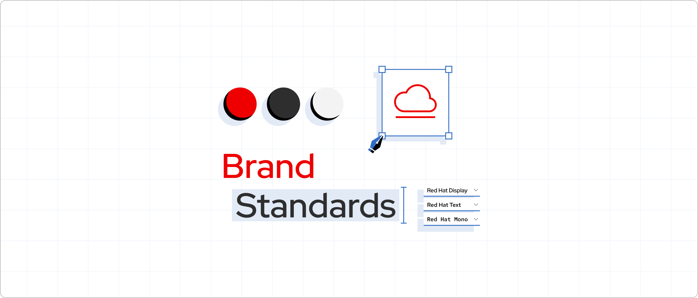
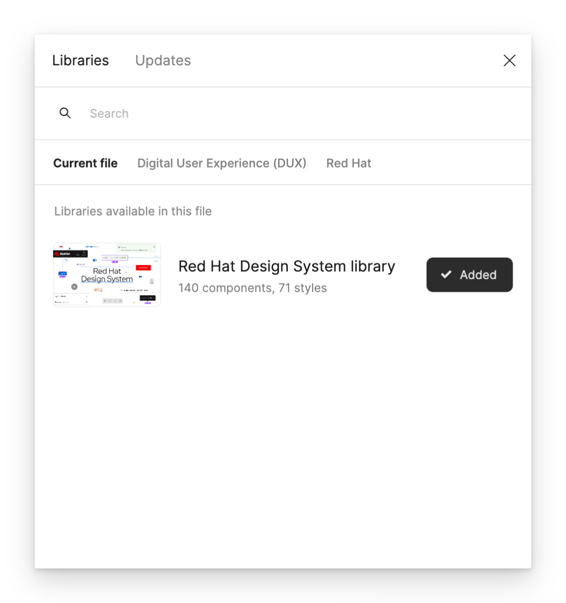
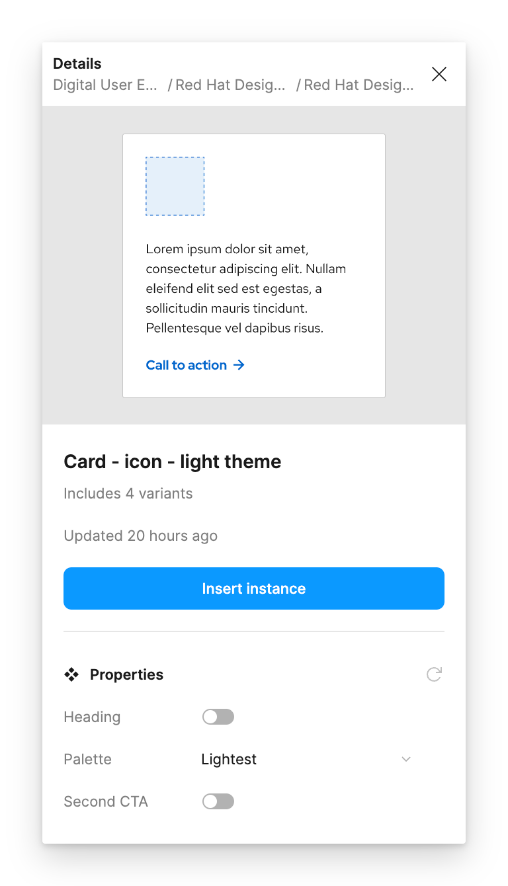
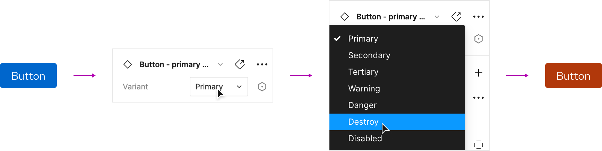
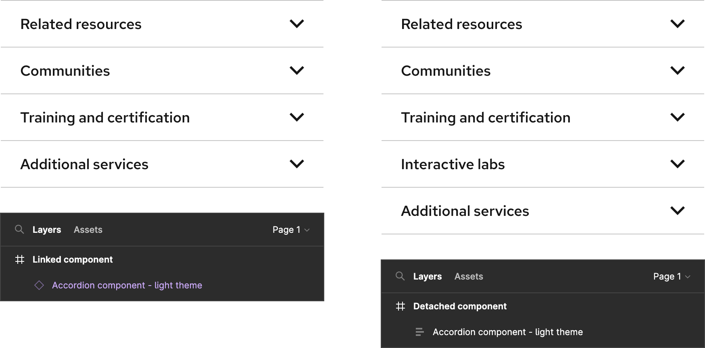

<link rel="stylesheet"
      href="/assets/packages/@rhds/elements/elements/rh-table/rh-table-lightdom.css"
      data-helmet>

{#
  the .page-designers rule allows for spacing of "sections" while only using
  headers which are converted to uxdot-copy-permalink
  TODO: determine if this is how we want to do this
#}

## Introduction

Welcome to the **Red Hat Design System** (RHDS) for digital experiences. If you
need to design something using our design system, you have come to the right
place.

Follow these steps to get started and e-mail 
[design-system@redhat.com][designsystemredhatcom] or connect with us
on Slack if you have any questions along the way.

## Explore brand standards

Our [Brand standards][brandstandards] are the source code of the Red Hat brand. 
Using brand standards as the starting point for every project ensures that every 
interaction with Red Hat reflects our brand personality, brand strategy, and 
consistent visual language. Consistency is how we create authentic relationships 
and credibility with our customers, partners, and contributors.

<uxdot-example variant="full">
  
</uxdot-example>

## Learn about our design system

Our design system libraries and the documentation website offer assets and
guidance needed to create digital experiences. Please read through each section
to have a better understanding of how to use our design system.

  

    <h3>Foundations</h3>
    
<a href="/foundations">Foundations</a> are how we express our brand through color, space, typography, etc.

  

  

    <h3>Design tokens</h3>
    
<a href="/tokens">Design tokens</a> are how we translate our design language decisions into code.

  

  

    <h3>Elements and patterns</h3>
    
Our libraries include <a href="/elements">elements</a> and <a href="/patterns">patterns</a> you can use to create digital experiences.

  

  

    <h3>Accessibility</h3>
    
<a href="/accessibility/design/">Designer-specific guidelines</a> equip you with the information to create inclusive digital experiences.

  

## Access Figma

You need a Figma license to access our libraries. When you are granted a
license, use your Red Hat e-mail address to log in to Figma via SSO
authentication. When you are logged in, you should be able to access our
libraries and add them to all of your
[drafts](https://help.figma.com/hc/en-us/articles/360038743434-Manage-libraries-for-your-drafts)
or [individual
files](https://help.figma.com/hc/en-us/articles/1500008731201-Manage-libraries-in-design-files).

<uxdot-example width-adjustment="60%">
  
</uxdot-example>

### Agency access

If you work with an agency and do not have a Red Hat e-mail address, e-mail
[design-system@redhat.com](mailto:design-system@redhat.com) and we will invite
you to view our libraries.

## Use libraries

Our libraries are built and maintained in Figma, our primary design tool. By
using our libraries, you will automatically receive notifications as we make
updates to our foundational styles, elements, and patterns (as long as you do
not detach them). This ensures that your designs are current and representative
of the latest design system release.

<rh-alert state="warning" variant="inline">
  <h3 slot="header">Warning</h3>
  
We no longer support Adobe XD. You need to migrate to Figma in order to access and use our most up-to-date libraries. Do not continue to use Adobe XD for any kind of design work. If you need assistance migrating XD files to Figma, e-mail <a href="mailto:design-system@redhat.com">mailto:design-system@redhat.com</a>.

</rh-alert>

### Core and subsystem libraries

The RHDS library is our core library that includes our foundational styles,
elements, and patterns needed to create digital experiences. We also offer
access to subsystem libraries that include project- or team- specific patterns
that pull from the RHDS library.

<rh-table>

| Library name             | Use case                                                                               |
| ------------------------ | -------------------------------------------------------------------------------------- |
| RHDS                     | Our core library for creating Red Hat digital experiences                              |
| [PatternFly][patternfly] | A library for creating application interfaces                                          |
| Tier 1 Events            | A library for tier 1 events, like Summit and AnsibleFest                               |
| Brand media              | A library for Red Hat original media like podcasts and video series                    |
| Page builder             | A library with a boilerplate template and components specific to Drupal's page builder |

</rh-table>

## Work in Figma

### Brand assets

If your project requires brand assets, the [Brand standards][brandstandards]
website has links to assets including icons, fonts, photography, etc. Icons will
be accessible via a subsystem Figma library very soon.

### Inserting elements and patterns

To use an element or pattern in your design, select the **Assets** tab. Find
your desired asset and drag it onto the canvas or frame. You can also preview an
asset by selecting it. When you are satisfied with the preview, select the
**Insert instance** button and the asset will appear on the canvas or frame. If
you have questions about how to use an element or pattern correctly, review the
documentation or connect with us on Slack.

<uxdot-example width-adjustment="40%">
  
</uxdot-example>

### Properties

Properties are changeable aspects of an element or pattern and you can see them
in the right sidebar when the asset is selected. Properties change the
appearance of an element or pattern so they can be used for different use cases.
Some examples of properties include state, theme, variant, etc.

<uxdot-example>
  
</uxdot-example>

### Responsive resize

Most elements and patterns can be resized to fit different viewport sizes. You
can change the height or width of an asset by dragging an edge or corner.

<uxdot-example>
  
</uxdot-example>

You can also use [Constraints][constraints] to tell Figma how layers should
respond when their frames are resized.

<uxdot-example>
  
</uxdot-example>

### Instance swap

To speed up your design process, you can swap elements or patterns instead of
dragging and dropping over and over again. Use the **Instance** menu to swap one
element for another from any enabled library. Changing a property will not
replace an element, but instance swapping will.

<uxdot-example>
  
</uxdot-example>

## Get familiar with GitHub

GitHub is how we maintain the design system. We also use it to track changes,
update the documentation website, store design tokens, and more in our [GitHub
repo][githubrepo]. To contribute to the design system, you will need to
familiarize yourself with creating an [issue][issue] using one of our templates,
creating a [discussion][discussion], and reviewing work in [pull
requests][pullrequests].

The [GitHub Wiki][githubwiki] can help you get started, and you can always chat
with us for additional help.

<uxdot-example variant="full">
  
</uxdot-example>

## Best practices

### Detaching an instance

Currently, you **cannot** add new items to an element or pattern instance that
you pull from a library. You need to detach it if you want to add new assets,
more slots, etc. If you believe that an element or pattern in any library needs
more slots for new items, [create an issue][createanissue] and we will try and
prioritize building them in.

<rh-alert state="warning" variant="inline">
  <h3 slot="header">Warning</h3>
  
Detached instances will not receive style or other updates from any of the libraries if that element or pattern is updated.

</rh-alert>

<uxdot-example width-adjustment="90%">
  
</uxdot-example>

### Alignment resources

Use these resources to help you stay aligned to our brand and design system while working.

-   [Brand standards][brandstandards]
-   [Foundations][foundations], [elements][elements], and
    [patterns][patterns]
-   Reference existing pages so you can see how brand and design system
    assets are being used
    -   [redhat.com home page][redhatcomhomepage]
    -   [Product page][productpage]
    -   [Resource article page][resourcearticlepage]
    -   [Catalog SERP][catalogserp]
    -   [Product trial page][producttrialpage]

## Frequently asked questions

<rh-accordion>
  <h3><rh-accordion-header>How can I get better at Figma?</rh-accordion-header></h3>
  <rh-accordion-panel>
    
Check out these resources if you want to improve your Figma skills.

    <ul>
      <li>YouTube channels like <a href="https://www.youtube.com/channel/UCQsVmhSa4X-G3lHlUtejzLA">Figma</a> and <a href="https://www.youtube.com/@UICollectiveDesign">UI Collective</a> have lots of free videos</li>
      <li>The <a href="https://www.figma.com/resource-library/">Figma Resource Library</a> has helpful content</li>
      <li>If all else fails, find answers in the <a href="https://help.figma.com/hc/en-us">Figma Help Center</a></li>
    </ul>
  </rh-accordion-panel>
  <h3><rh-accordion-header>How do foundational styles, elements, and patterns get updated?</rh-accordion-header></h3>
  <rh-accordion-panel>
    
The design system team meets regularly to discuss work in progress and new issues. Updates are assigned a priority in our GitHub backlog. Once a priority is set and a schedule is agreed upon, design or development work begins. When the work is completed, the Figma libraries, documentation website, and repos are all updated. All updates are tracked in our <a href="https://github.com/RedHat-UX/red-hat-design-system/releases">changelog</a> and listed on the <a href="https://ux.redhat.com/release-notes/">Release notes</a> page. Larger updates are sometimes communicated via a quarterly newsletter e-mail.

  </rh-accordion-panel>
  <h3><rh-accordion-header>What if an element or pattern I need is missing?</rh-accordion-header></h3>
  <rh-accordion-panel>
    
If you think something is missing or you cannot find something, connect with us on Slack or <a href="https://github.com/orgs/RedHat-UX/discussions/new/choose">create a discussion</a>.

  </rh-accordion-panel>
  <h3><rh-accordion-header>How can I contribute an idea?</rh-accordion-header></h3>
  <rh-accordion-panel>
    
If you have feedback or you would like to contribute an idea, <a href="https://github.com/orgs/RedHat-UX/discussions/new/choose">create a discussion</a>

  </rh-accordion-panel>
  <h3><rh-accordion-header>How can I report a bug?</rh-accordion-header></h3>
  <rh-accordion-panel>
    
If you find a bug, <a href="https://github.com/RedHat-UX/red-hat-design-system/issues/new/choose">create an issue</a> and describe it as thoroughly as possible. If something is broken, e-mail <a href="mailto:design-system@redhat.com" style="white-space: nowrap;">design-system@redhat.com</a> or connect with us on Slack and we will investigate.

  </rh-accordion-panel>
</rh-accordion>

## Roadmap

You can learn about our current release or future plans by going to the
[Roadmap][roadmap] page. If you need something created sooner rather than later,
[create an issue][createanissue], or e-mail
[design-system@redhat.com][designsystemredhatcom], and we will discuss the
priority and timeline.

## Connect with us

For questions, additional support, or training, e-mail
[design-system@redhat.com][designsystemredhatcom] or connect with us on Slack.

## Additional resources

- [Brand standards][brandstandards]
- [Fonts][fonts]
- [GitHub repo][githuborg]
- [RHa11y Resource Hub][rha11yresourcehub]

<uxdot-feedback>
  <h2>Developers</h2>
  
To get started using our design system as a developer, go to the <a href="../developers/">Developers</a> page.

</uxdot-feedback>

[brandstandards]: https://www.redhat.com/en/about/brand/standards
[catalogserp]: https://catalog.redhat.com/software/search?functionalCategories=AI%20%26%20machine%20learning
[constraints]: https://help.figma.com/hc/en-us/articles/360039957734-Apply-constraints-to-define-how-layers-resize
[createanissue]: https://github.com/RedHat-UX/red-hat-design-system/issues/new/choose
[designsystemredhatcom]: mailto:design-system@redhat.com
[discussion]: https://github.com/RedHat-UX/red-hat-design-system/discussions
[elements]: /elements
[fonts]: https://github.com/RedHatOfficial/RedHatFont
[foundations]: /foundations
[githuborg]: https://github.com/RedHat-UX
[githubrepo]: https://github.com/RedHat-UX/red-hat-design-system
[githubwiki]: https://github.com/RedHat-UX/red-hat-design-system/wiki
[issue]: https://github.com/RedHat-UX/red-hat-design-system/issues
[patternfly]: https://www.patternfly.org/
[patterns]: /patterns
[productpage]: https://www.redhat.com/en/technologies/cloud-computing/openshift
[producttrialpage]: https://www.redhat.com/en/technologies/linux-platforms/enterprise-linux/server/trial
[pullrequests]: https://github.com/RedHat-UX/red-hat-design-system/pulls
[redhatcomhomepage]: https://redhat.com/
[resourcearticlepage]: https://www.redhat.com/en/topics/cloud-computing/what-are-cloud-services
[rha11yresourcehub]: https://github.com/hellogreg/rha11y-tools
[roadmap]: https://ux.redhat.com/about/roadmap/
