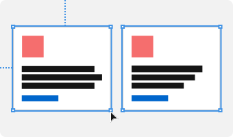
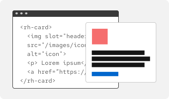

<link data-helmet rel="stylesheet" href="/assets/packages/@rhds/elements/elements/rh-tile/rh-tile-lightdom.css">

## Get started

The Red Hat Design System for digital experiences gives designers and developers the tools to create accessible and on-brand user interfaces quickly. The role-specific pages linked below will guide you through using the design system.

<nav id="get-started-nav" aria-label="Get Started" class="grid sm-two-columns">
  <rh-tile>
    <uxdot-example slot="image" no-border variant="full" transparent>
      
    </uxdot-example>
    <h3 slot="headline"><a href="./designers">Designers</a></h3>
  </rh-tile>
  <rh-tile>
    <uxdot-example slot="image" no-border variant="full" transparent>
      
    </uxdot-example>
    <h3 slot="headline"><a href="./developers">Developers</a></h3>
  </rh-tile>
</nav>

<uxdot-feedback>
  <h2>Release notes</h2>
  
To see what foundations, tokens, elements, or patterns have been released recently, check out our <a href="/release-notes">release notes</a>.

</uxdot-feedback>
