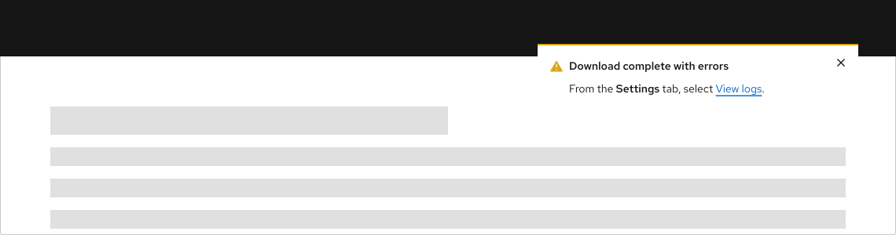

## Toasted alerts

<uxdot-example variant="full" color-palette="lightest">
  
</uxdot-example>

Use this pattern for toast alerts: short, global messages that confirm an action
or share a lightweight update without blocking the rest of the page. RHDS
implements toasts with [`<rh-alert>`](/elements/alert/) and the static
`RhAlert.toast()` API, which manages stacking, animation, and persistence.

<rh-alert state="caution">
  <h3 slot="header">Accessibility considerations</h3>
  
There are accessibility considerations to keep in mind when using toasts. See our toast <a href="/patterns/alert/guidelines/">accessibility guidelines</a> for more information.

</rh-alert>

These pattern pages focus on toast usage. For inline and alternate alerts
(messages tied to a specific region or form), slots, attributes, inline
variants, and element-level accessibility tables, see the
[Alert element](/elements/alert/) documentation.


