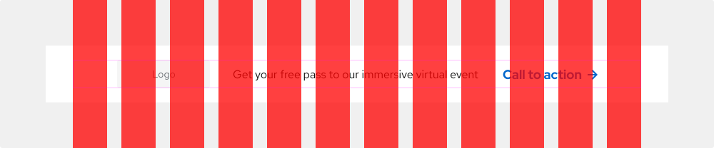
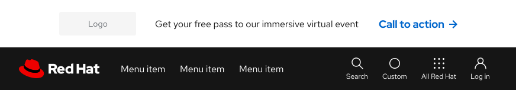
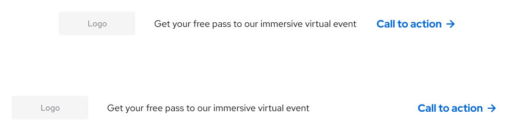
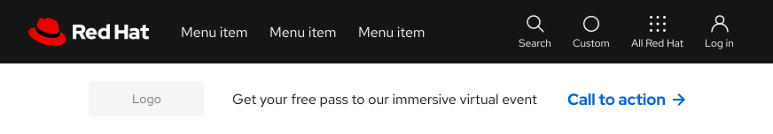
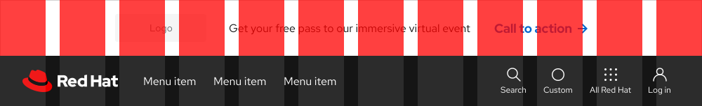
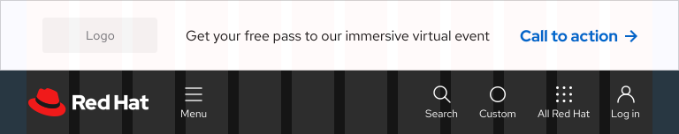
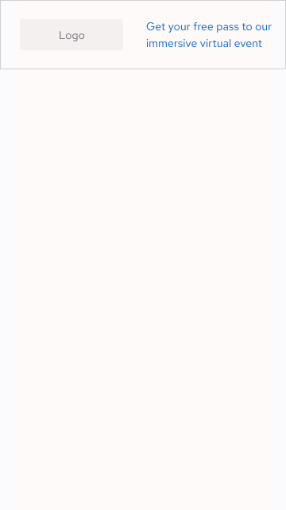
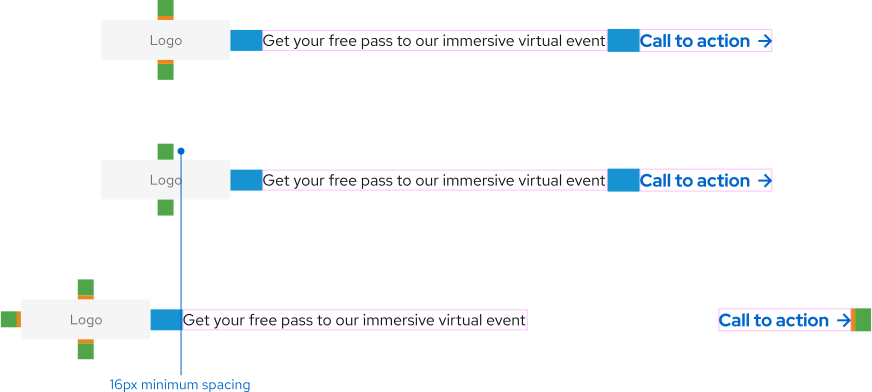

<link rel="stylesheet" data-helmet href="/assets/packages/@rhds/elements/elements/rh-table/rh-table-lightdom.css">
<link rel="stylesheet" data-helmet href="/styles/samp.css">

## Overview

An Announcement is a short banner that promotes an important message. It can be
used across websites, depending on the relevance of the message and the target
audience.

## Sample implementation

<uxdot-example width-adjustment="872px">
  
</uxdot-example>

## Style

An announcement banner can be used in light, dark, and saturated themes. It can
feature elements like text, a button, a call to action, icons, imagery, or a
background container.

<uxdot-example width-adjustment="872px">
  
</uxdot-example>

## Theme

<uxdot-example width-adjustment="872px">
  
</uxdot-example>

<uxdot-example color-palette="darkest" width-adjustment="872px">
  
</uxdot-example>

## Usage

An announcement banner can promote a popular event or advertise an important
organizational or product announcement.

### Grid

An announcement banner doesn’t fall within the grid. It spans the entire width
of a browser window on all screens whereas the content of the banner itself
should fall within the standard grid.

<uxdot-example width-adjustment="1000px">
  
</uxdot-example>

### Layout

An announcement banner should be positioned above the navigation so it becomes
the highest layout in hierarchy. It can also be used across different pages to
better attract attention from visitors who might be coming from different
places.

<uxdot-example width-adjustment="872px">
  
</uxdot-example>

### Content

Any content within an announcement banner can either be center-aligned or
aligned to the left and right sides, depending on the amount of content and what
its objective is.

<uxdot-example width-adjustment="872px">
  
</uxdot-example>

### Character count

The recommended maximum character count for the elements of an announcement are
listed below and include spaces.

<rh-table>

| Element        | Character count |
|----------------|-----------------|
| Text           | 60              |
| Call to action | 20              |

</rh-table>

## Best practices

Do not position the announcement banner below the navigation.

<uxdot-example width-adjustment="872px" danger>
  
</uxdot-example>

## Behavior

### Persistence

An announcement banner sits above the navigation and can be sticky, but should
not be visible on scroll if the navigation of the site is also in fixed
position.

## Responsive design

### Breakpoints

An announcement banner works well across both large and small screens. The
elements inside will stack in one column and become vertically-aligned on small
screens.

#### Desktop

<uxdot-example width-adjustment="1000px" variant="full" alignment="left" no-border>
  
</uxdot-example>

#### Tablet

<uxdot-example width-adjustment="768px" variant="full" alignment="left" no-border>
  
</uxdot-example>

#### Mobile

<uxdot-example width-adjustment="360px" variant="full" alignment="left" no-border>
  
</uxdot-example>

Some text styles reduce in size on small screens. Learn more about
[typography](../../foundations/typography) on mobile {.footnote}

## Interaction states

Since announcement banners can consist of a variety of elements, refer to the
specific interaction states that are assigned to each style and component for
more information.

## Spacing

The announcement banner uses [space tokens](/tokens/space/) to define spacing
values between elements.

<uxdot-example width-adjustment="872px">
  
</uxdot-example>

<rh-table>

</rh-table>


