<link rel="stylesheet" data-helmet href="/assets/packages/@rhds/elements/elements/rh-table/rh-table-lightdom.css">
<link rel="stylesheet" data-helmet href="/styles/samp.css">

## Overview

A Disclosure toggles the visibility of sections of content. It features one 
panel that consists of a caret icon and a section text label that collapses or 
expands to reveal more information.

## Sample pattern

<rh-accordion>
  <h2><rh-accordion-header>Results from Customer Portal</rh-accordion-header></h2>
  <rh-accordion-panel>
    
Amet dolor deserunt consectetur enim. Amet irure esse est minim sint eu 
      aliquip officia nulla dolore proident. Voluptate dolore nisi aute ut amet 
      quis elit. Id voluptate et ipsum commodo aute do. Eu excepteur sunt ex 
      nostrud sit cillum eu excepteur aliqua fugiat. Tempor ad exercitation amet 
      ad tempor esse.

    
Aliqua aliqua do fugiat incididunt voluptate eiusmod. Pariatur laborum 
      aliquip cupidatat esse amet. Velit fugiat irure amet enim proident labore 
      qui eu excepteur. Sit tempor officia ex nisi dolor. Culpa exercitation ad 
      aliquip duis mollit ipsum.

  </rh-accordion-panel>
</rh-accordion>

## Style

A disclosure can be used in light and dark themes. It consists of one
panel that features a border around the entire container when collapsed
and expanded. The panel contains a text label for the section and a
caret icon that rotates to indicate if a panel is collapsed or expanded.
When the panel is expanded, it includes different styling that consists
of an active border on the left and a slight drop shadow, similar to an
[Accordion](/elements/accordion).

<uxdot-example width-adjustment="884px" variant="full" alignment="left" no-border>
  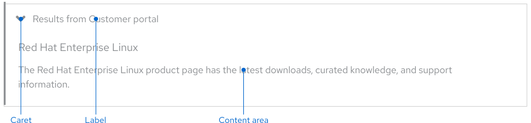
</uxdot-example>

### Theme

<uxdot-example width-adjustment="884px">
  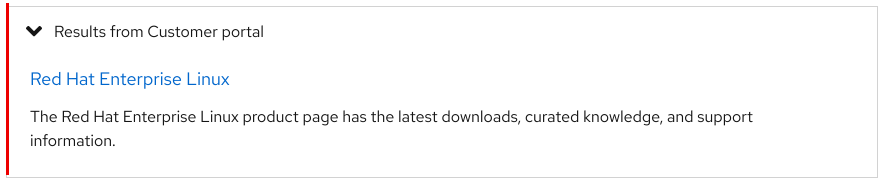
</uxdot-example>

<uxdot-example width-adjustment="872px" color-palette="darkest">
  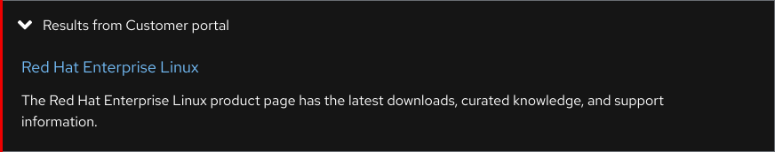
</uxdot-example>

## Usage

A disclosure is used for storing *supplementary* content in a contained space, 
like extra search results. It enables a user to collapse or expand information 
as needed on the current page.

A disclosure is great for hiding extra information that’s not a crucial part 
of the user experience, it’s also beneficial because it reduces page 
scrolling. Consider whether a disclosure should be used. If content is crucial 
or requires more focus to read, don’t use a disclosure.

<uxdot-example width-adjustment="884px" variant="full" alignment="left" no-border>
  
</uxdot-example>

### Usage vs. Accordion

A disclosure only has one section panel. If more than one panel is needed, use 
an accordion instead. A disclosure is used to store supplementary content that 
might not be a crucial part of the user experience whereas accordions are used 
to organize more important information.

A disclosure features slightly different styles than accordions. A disclosure 
has the caret icon positioned on the left before the section text label 
whereas accordions have the caret icon placed on the right after the section 
text label.

  <uxdot-example width-adjustment="340px">
    <h4>Disclosure</h4>
    
  </uxdot-example>

  <uxdot-example width-adjustment="340px">
    <h4>Accordion</h4>
    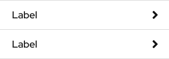
  </uxdot-example>

### Label formatting

Section text labels should be written concisely and be representative of the 
content within. Be mindful of lengthy character counts and how they’ll impact 
the appearance of a disclosure, especially on smaller screens or if they’re 
translated.

### Content area

When the panel is expanded, it contains a content area under the caret icon and 
section text label. It may contain the same elements that can also be used in 
other sections of a page, like text, cards, images, etc. To maintain optimal 
readability, text shouldn’t exceed eight grid columns.

### Character count
The label should have fewer characters to help users make sense of what the content will be when they expand a content area.

<rh-table>

| Element | Character count |
|---------|-----------------|
| Label   | 65              |

</rh-table>

### Jump links

On small screens, vertical [Jump links](/elements/jump-links/) can be wrapped in 
a disclosure and act as persistent navigation.

<uxdot-example width-adjustment="884px" variant="full" alignment="left" no-border>
  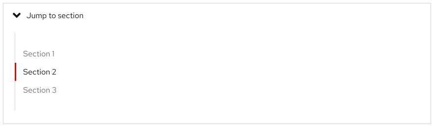
</uxdot-example>

## Best practices

A disclosure consists of one panel only. If more than one panel is needed, use 
an accordion instead.

<uxdot-example width-adjustment="872px" danger>
  
  
</uxdot-example>

Text inside the panel shouldn’t exceed eight grid columns to maintain optimal 
readability.

<uxdot-example width-adjustment="884px" danger>
  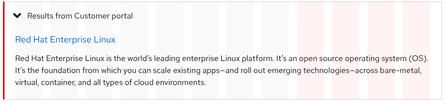
</uxdot-example>

Don’t wrap other complex components inside of a disclosure unless absolutely 
necessary, like jump links.

<uxdot-example width-adjustment="884px" danger>
  
</uxdot-example>

## Behavior

### States

A disclosure can be collapsed and expanded to hide or reveal information when 
toggled. By default, it loads with its panel collapsed (this can be customized), 
allowing users to get a quick preview of the content inside.

### Collapsing and expanding

The disclosure panel can be collapsed or expanded by clicking on or tapping the 
caret icon, the  section text label, or anywhere inside the container. When the 
panel is collapsed, the caret icon points to the right toward the text. When the 
panel expands, the caret icon rotates 90º and points down, revealing the content 
inside.

<uxdot-example width-adjustment="884px">
  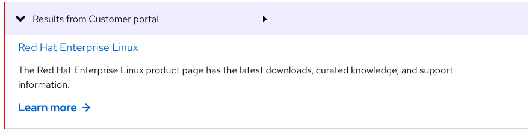
</uxdot-example>

### Tab order

When the <kbd>Tab</kbd> key is pressed, the focus indicator highlights the 
collapsed disclosure. When a user expands the panel by pressing the 
<kbd>Enter</kbd> or <kbd>Space</kbd> keys, any interactive elements inside are 
added to the tab order before the focus indicator moves away to the next section 
of content.

<uxdot-example width-adjustment="884px">
  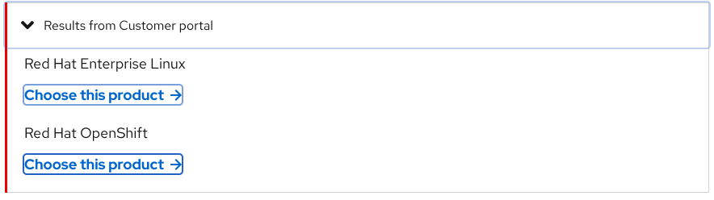
</uxdot-example>

## Responsive design

A disclosure works well when used on both large and small screens.

### Breakpoints

Disclosures can be used on smaller screens, but the limited screen space makes 
content taller which might make users scroll more, so be careful about how much 
content is included.

### Desktop

<uxdot-example width-adjustment="1012px" variant="full" alignment="left" no-border>
  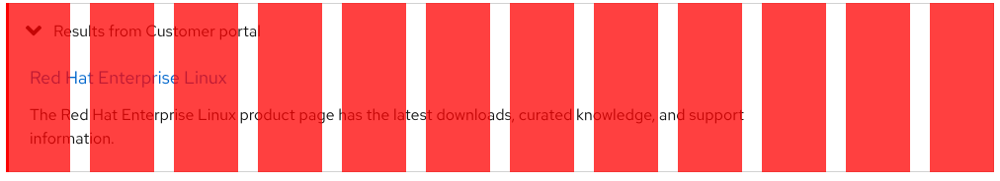
</uxdot-example>

### Tablet

<uxdot-example width-adjustment="768px" variant="full" alignment="left" no-border>
  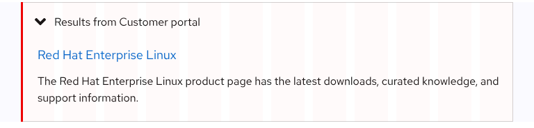
</uxdot-example>

### Mobile

<uxdot-example width-adjustment="360px" variant="full" alignment="left" no-border>
  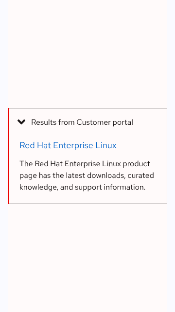
</uxdot-example>

## Interaction states

The interaction states in the collapsed state are the same as the expanded 
state.

<rh-accordion>
  <h2><rh-accordion-header>Officia eu id pariatur enim exercitation ipsum laboris irure reprehenderit</rh-accordion-header></h2>
  <rh-accordion-panel>
    
Amet dolor deserunt consectetur enim. Amet irure esse est minim sint eu aliquip officia nulla dolore proident. Voluptate dolore nisi aute ut amet quis elit. Id voluptate et ipsum commodo aute do. Eu excepteur sunt ex nostrud sit cillum eu excepteur aliqua fugiat. Tempor ad exercitation amet ad tempor esse.

    
Aliqua aliqua do fugiat incididunt voluptate eiusmod. Pariatur laborum aliquip cupidatat esse amet. Velit fugiat irure amet enim proident labore qui eu excepteur. Sit tempor officia ex nisi dolor. Culpa exercitation ad aliquip duis mollit ipsum.

  </rh-accordion-panel>
</rh-accordion>

## Spacing

The announcement banner uses [space tokens](/tokens/space/) to define spacing 
values between elements.

<uxdot-example width-adjustment="884px">
  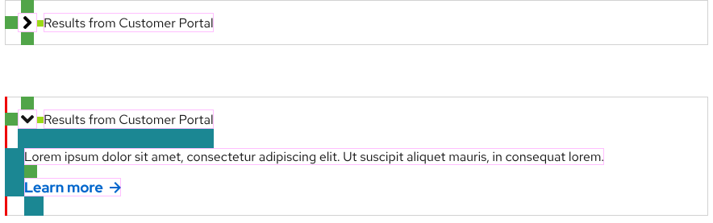
</uxdot-example>

<rh-table>
 
</rh-table>


