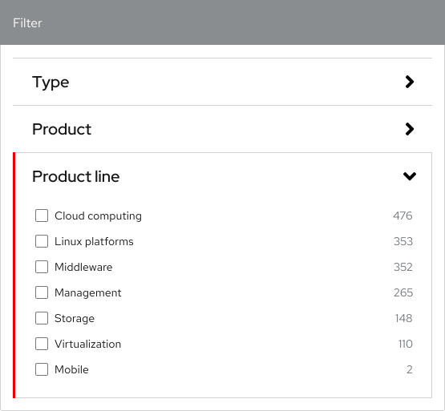
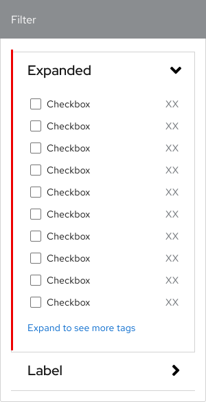
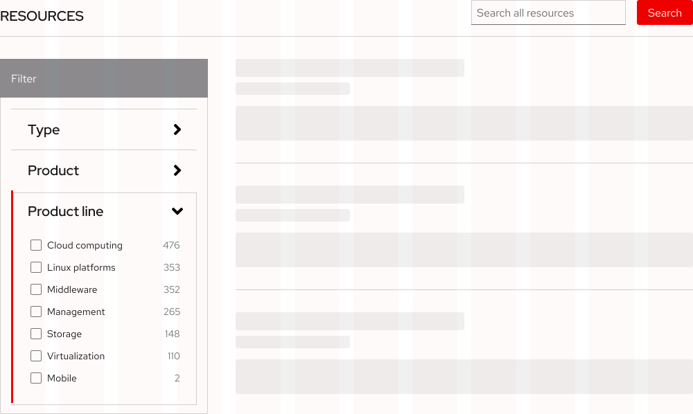

<link rel="stylesheet" data-helmet href="/assets/packages/@rhds/elements/elements/rh-table/rh-table-lightdom.css">
<link rel="stylesheet" data-helmet href="/styles/samp.css">

## Overview

A Filter gives users the ability to sort a results listing by turning on and off
predetermined tags. They feature a list of checkboxes and text that are wrapped
in an accordion or a disclosure.

## Sample pattern

  <uxdot-example width-adjustment="300px" color-palette="lightest">
    
  </uxdot-example>
  <uxdot-example width-adjustment="300px" color-palette="lightest">
    
  </uxdot-example>

## Style

A filter can be used in the light theme only. It features a list of checkboxes
and text that are wrapped in an [Accordion](../accordion) or a
[Disclosure](../disclosure). Content categories can be represented by accordion
panels that users can expand to view the checkboxes inside. When one or more
checkboxes are selected, a button will appear that gives users the option to
reset their selections.

<uxdot-example width-adjustment="600px" color-palette="lightest">
  
</uxdot-example>

## Usage

A filter helps users narrow down pages of data into customized results.
Accordions are used to organize content into categories and checkboxes are used
to display specific content tags.

### Selection methods

A filter has several selection methods that enable users to narrow down what
they’re looking for. This improves usability and efficiency by reducing the
amount of time that users spend searching for something.

  <figure>
    <uxdot-example width-adjustment="300px" color-palette="lightest">
      
    </uxdot-example>
    <figcaption>A user can select one or multiple tags to sort by in one category</figcaption>
  </figure>
  <figure>
    <uxdot-example width-adjustment="300px" color-palette="lightest">
      
    </uxdot-example>
    <figcaption>A user can select multiple tags to sort by in multiple categories</figcaption>
  </figure>

### Content area

When a category panel is expanded, only the tags that are available are
displayed.

### Layout

On large screens, a filter is placed in the left aside region of a page whereas
on small screens, it’s placed under the search field. A filter is aligned to the
top edge of the content set on large screens which makes it easy for users to
search for something and filter the results simultaneously.

## Best practices

Even when used in a filter, accordions still require at least two panels. If
only one panel is needed, use a disclosure instead.

<uxdot-example width-adjustment="300px" color-palette="lightest">
  
</uxdot-example>

Don’t change the width of a filter on large screens because the aside region is
already a fixed width.

<uxdot-example width-adjustment="555px" danger color-palette="lightest">
  
</uxdot-example>

## Behavior

### States

By default, a filter loads with all category panels collapsed, enabling users to
get a high-level overview of the available content, but this can be customized.
Category panels have collapsed and expanded states that hide or reveal tags when
toggled.

<uxdot-example width-adjustment="664px" variant="full" alignment="left" no-border>
  
</uxdot-example>

### Multiple panels

Multiple category panels can be expanded simultaneously or stack. Expanding one
panel doesn’t collapse another which makes it easy for users to search for and
filter content in the same view.

<uxdot-example width-adjustment="664px" variant="full" alignment="left" no-border>
  
</uxdot-example>

### Selecting checkboxes

A filter is also required to load with all checkboxes unselected which means
that a result set is displayed all at once. The amount of content narrows down
as more checkboxes are selected. When a user selects one or more checkboxes, the
list and the content set will refresh to display any content with the
corresponding tags. The bar above the accordion will also display the number of
checkboxes that are currently selected.

<uxdot-example width-adjustment="664px" variant="full" alignment="left" no-border>
  
</uxdot-example>

### Progressive disclosure

If there are more than 10 checkboxes in one category panel, not all of them
should be displayed. An Expand to see more tags label can be added at the bottom
of the list of checkboxes that acts a progressive disclosure. When selected, it
reveals an additional five checkboxes until all checkboxes are displayed.

<uxdot-example width-adjustment="300px" variant="full" alignment="left" no-border>
  
</uxdot-example>

### Clear all button

When one or more checkboxes are selected, a button appears above the accordion
that allows a user to reset the filter. Pressing this button will deselect every
checkbox, collapse every category panel, and revert the content set back to
displaying everything.

### Responsive design

When a filter is used on screens that are smaller than 768px wide, it stretches
to fit the entire grid column and the top bar turns into a disclosure which
hides or reveals the filter.

## Responsive design

### Breakpoints

A filter can work well in a variety of layouts. On small screens, it stretches
to fit the entire grid column. Otherwise, it’s placed in the same layout as the
content set.

<uxdot-example width-adjustment="708px" variant="full" alignment="left" no-border>
  
</uxdot-example>

### Desktop

<uxdot-example width-adjustment="1000px" variant="full" alignment="left" no-border color-palette="lightest">
  
</uxdot-example>

### Tablet

<uxdot-example width-adjustment="768px" variant="full" alignment="left" no-border color-palette="lightest">
  
</uxdot-example>

### Mobile

<uxdot-example width-adjustment="360px" variant="full" alignment="left" no-border color-palette="lightest">
  
</uxdot-example>

## Interaction states

A filter is a collection of components and the interaction states remain the
same for each, like accordion, disclosure, button, and [Data inputs](../form).

### Default

<uxdot-example width-adjustment="664px" variant="full" alignment="left" no-border>
  
</uxdot-example>

### Focus

<uxdot-example width-adjustment="664px" variant="full" alignment="left" no-border>
  
</uxdot-example>

### Hover

<uxdot-example width-adjustment="664px" variant="full" alignment="left" no-border>
  
</uxdot-example>

### Tab order

When the Tab key is pressed repeatedly, the focus indicator moves from top to
bottom. When a category panel is expanded, checkboxes and text are added to the
tab order before the focus indicator reaches the next panel.

<uxdot-example width-adjustment="664px" variant="full" alignment="left" no-border>
  
</uxdot-example>

## Spacing

A filter uses [space tokens](/tokens/space/) to define spacing
values between elements.

<uxdot-example width-adjustment="664px">
  
</uxdot-example>

<uxdot-spacer-tokens-table tokens="xs, sm, lg, xl"></uxdot-spacer-tokens-table>


