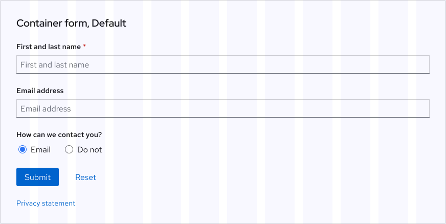

<link rel="stylesheet" data-helmet href="/assets/packages/@rhds/elements/elements/rh-table/rh-table-lightdom.css">
<link rel="stylesheet" data-helmet href="/styles/samp.css">

## Overview

A Form is a group of elements used to collect information from a user. It can 
include a combination of text, fields, select lists, data inputs, buttons, and 
more.

## Sample pattern

<uxdot-example width-adjustment="736px">
  
</uxdot-example>

## Style

<uxdot-example width-adjustment="660px">
  
</uxdot-example>

### Visual elements

There are a variety of form elements available for use depending on what information needs to be collected from or displayed to a user.
 - **Title and body text** - Title and body text styles explaining why a user should fill out a form.
 - **Text label** - Small text describing what a user needs to input into a form element.
 - **Popover** - Small card with helpful content that appears near a popover icon when triggered.
 - **Form field or Select list** - Text box or dropdown allowing a user to input text or make a selection.
 - **Data inputs** - Alternate components allowing a user to input other kinds of information.
 - **Buttons** - Actions used to submit or clear a form.
 - **Privacy link** - Text linking to privacy documentation (included when a form is used on marketing websites).

<rh-alert state="info">
  <h4 slot="header">Learn more</h4>
  
Visit the <a href="./elements/popover/">Popover</a> component page to learn more about how to use a popover.

</rh-alert>

<uxdot-example width-adjustment="824px">
  
</uxdot-example>

### Variants

There are two form variants available for use.
 - **Container** - Form elements are contained in a card and the title and body text sizes are slightly smaller.
 - **Floating** - Form elements float in a group and the title and body text sizes are slightly larger.

<uxdot-example width-adjustment="736px">
  
</uxdot-example>

## Theme

### Light theme

<uxdot-example width-adjustment="360px">
  
</uxdot-example>

### Dark theme

<rh-alert state="info">
  <h4 slot="header">Coming soon</h4>
  
More details and specs surrounding dark theme are coming soon.

</rh-alert>

<uxdot-example color-palette="darkest" width-adjustment="360px">
  
</uxdot-example>

## Orientation

### Default

In the Default orientation, form elements are organized vertically and the text 
labels are positioned **on top**. All form elements and groups are aligned to 
the left edge and some elements span the width of the form, like a field.

<rh-alert state="warning">
  <h4 slot="header">Warning</h4>
  
Do not write text labels with <strong>more than a few words</strong> as 
    they might break to two lines or make the form hard to scan.

</rh-alert>

<uxdot-example width-adjustment="736px">
  
</uxdot-example>

### Horizontal

In the Horizontal orientation, form elements are still organized vertically, but 
the text labels are positioned **to the left**. Form elements without a text 
label, like the button group or privacy link, should be aligned to the left edge 
of other form elements with text labels.

<rh-alert state="info">
  <h4 slot="header">Helpful tip</h4>
  
Form variants in the Horizontal orientation span more grid columns, so only 
    use them if there is ample space or enough padding near content.

</rh-alert>

<rh-alert state="warning">
  <h4 slot="header">Warning</h4>
  
Do not write text labels with <strong>more than a few words</strong> as 
    they might break to two lines or make the form hard to scan.

</rh-alert>

<uxdot-example width-adjustment="750px">
  
</uxdot-example>

<uxdot-example width-adjustment="750px">
  
</uxdot-example>

### Text label alignment

In the Horizontal orientation, text labels should be **left justified** making it easy for a user to scan.

<uxdot-example width-adjustment="872px">
  
</uxdot-example>

## Usage

A form is best used to guide a user through a task while gathering information 
from them.

### Container variant

When the Container variant is positioned on the grid, it may span between four 
and eight columns, and be oriented on the left, center, or right side of the 
page.

<rh-alert state="info">
  <h4 slot="header">Helpful tip</h4>
  
When the Container variant is positioned near content, there should be 
    <strong>at least one</strong> grid column of padding in between.

</rh-alert>

<uxdot-example width-adjustment="1000px" variant="full" alignment="left" no-border>
  
</uxdot-example>

### Floating variant

When the Floating variant is positioned on the grid, it may span between four 
and eight columns, and be oriented on the left, center, or right side of the 
page.

<rh-alert state="info">
  <h4 slot="header">Helpful tip</h4>
  
When the Floating variant is positioned near content, there should be 
    <strong>at least one</strong> grid column of padding in between.

</rh-alert>

<uxdot-example width-adjustment="1000px" variant="full" alignment="left" no-border>
  
</uxdot-example>

<uxdot-example width-adjustment="1000px" variant="full" alignment="left" no-border>
  
</uxdot-example>

### Form content

A user will have a better experience with submitting a form if the elements are easy for them to identify and move between.
 - **Text label** - Use to identify form elements that are required or recommended.
 - **Popover** - Use to display helpful information near form elements that may need more explanation beyond text labels.
 - **Form field or Select list** - Use to write text or make a selection from a list.
 - **Placeholder text** - Use within a form field or select list as an example of how to correctly provide an input.
 - **Helper text** - Use underneath a form element as an example of how to correctly provide an input.

<uxdot-example width-adjustment="296px">
  
</uxdot-example>

### Required fields

If a user is required to input information when submitting a form, indicate 
exactly where by adding a required asterisk (*) to the right of a text label. If all inputs are required, 
**do not** add an asterisk next to every text label. Instead, add text below the 
title stating **All fields are required**. If all inputs are optional, the text 
should state **All fields are optional** instead.

<uxdot-example width-adjustment="736px">
  
</uxdot-example>

### Data inputs

Data inputs provide additional ways for a user to submit information. Each data 
input has a specific use case and different data input groups can be used in the 
same form.

<uxdot-example width-adjustment="576px">
  
</uxdot-example>

### Using data inputs

A variety of data inputs can be used in the same form to allow a user to submit 
more information.

<rh-table>
  <table>
    <thead>
      <tr>
        <th scope="col">Data input name</th>
        <th scope="col">Usage</th>
      </tr>
    </thead>
    <tbody>
      <tr>
        <td>Radio button</td>
        <td>Use when only one option can be chosen from a list of no more than five options.</td>
      </tr>
      <tr>
        <td>Checkbox</td>
        <td>Use when either several or no options can be chosen from a list of no more than five options.</td>
      </tr>
      <tr>
        <td>Select list</td>
        <td>Use to select one or more options from a list of more than five options.</td>
      </tr>
      <tr>
        <td>Switch</td>
        <td>Use to toggle between two different states.</td>
      </tr>
    </tbody>
  </table>
</rh-table>

### Arranging data inputs

Radio buttons and checkboxes can be stacked horizontally or vertically depending on the amount of characters and space.
 - If there are fewer than three options, arrange data inputs horizontally.
 - If there are more than three options, arrange data inputs vertically.

<uxdot-example width-adjustment="462px">
  
</uxdot-example>

### Popover

If a form element requires more explanation beyond text labels, use a popover to 
help a user better understand what they need to input. The content in a popover 
can include text or links to help documents or other websites. When adding a 
popover to a form, a small icon should be added next to a text label which acts 
as a trigger to display the popover.

<rh-alert state="info">
  <h4 slot="header">Learn more</h4>
  
Visit the <a href="./elements/button/">Popover</a> component page to learn 
    more about how to use a popover.

</rh-alert>

<rh-alert info="warning">
  <h4 slot="header">Warning</h4>
  
Avoid using a popover for critical information, a user will have a hard 
    time finding what they need if they have to trigger something first.

</rh-alert>

<uxdot-example width-adjustment="406px">
  
</uxdot-example>

### Placement

A form can span various grid columns when used on a page. To preserve 
readability, it should span at least four grid columns but not exceed eight grid 
columns (or 750px).

<uxdot-example width-adjustment="1000px">
  
</uxdot-example>

<uxdot-example width-adjustment="1000px">
  
</uxdot-example>

## Behavior

### Disabled state

In some cases, a form element can be disabled if a user needs to make an input 
somewhere else first. In this example, a user is **required** to select their 
department first and then optionally select their job role afterwards. A user 
can still submit a form successfully if they skip an optional form element.

<rh-alert state="warning">
  <h4 slot="header">Warning</h4>
  
Do not disable form elements that <strong>require</strong> input as a user 
    might skip over them leading to errors when the form is submitted.

</rh-alert>

<uxdot-example width-adjustment="720px">
  
</uxdot-example>

### Error states

When a user submits a form that results in errors, it is important to explain 
what the errors are and how to resolve them. There are **two error states** that 
can be displayed depending on how a user moves through the form.

### Error validation on loss of focus

An error will be displayed after a user moves the focus away from a required 
form element. This can also happen when a user inputs something with an invalid 
format or leaves a required form element blank or incomplete. The error text and 
icons will disappear when the errors are resolved and the focus is moved away 
once again.

<uxdot-example width-adjustment="360px">
  
</uxdot-example>

### Error validation on submission

Errors will be displayed if a user tries to submit a completed form with invalid 
information or not filled out completely. When this happens, a [Danger severity 
alert](/elements/alert/) is displayed stating there are errors that need to be 
resolved. The alert is positioned below the title and body text, and has the 
same width as the widest form element. The alert will disappear when the errors 
are resolved and the form is submitted again.

<uxdot-example width-adjustment="360px">
  
</uxdot-example>

## Interaction states

<rh-alert state="info">
  <h4 slot="header">See more</h4>
  
Visit the <a href="./elements/button/">Button</a> and <a 
    href="./elements/link/">Link</a> component pages to see available 
    interaction states.

</rh-alert>

### Link

<uxdot-example width-adjustment="300px">
  
</uxdot-example>

### Hover

Form fields and select lists share the same hover state.

<uxdot-example width-adjustment="300px">
  
</uxdot-example>

### Focus

When the focus is moved to a form field with placeholder text, the text will 
disappear and a blinking cursor will be visible.

<uxdot-example width-adjustment="300px">
  
</uxdot-example>

### Active

Form fields and select lists share the same active state.

<uxdot-example width-adjustment="300px">
  
</uxdot-example>

### Tab order

When the Tab key is pressed repeatedly, the focus highlights each form element 
in order, from top to bottom or left to right.

<uxdot-example width-adjustment="1000px">
  
</uxdot-example>

## Accessibility

<rh-table>

| Key                    | Action                                                                               |
| ---------------------- | ------------------------------------------------------------------------------------ |
| <kbd>Tab</kbd>         | Moves the focus to the next form element.                                            |
| <kbd>Shift + Tab</kbd> | Moves the focus to the previous form element.                                        |
| <kbd>Space</kbd>       | Opens/closes a popover, opens/closes a select list, or selects/toggles a data input. |
| <kbd>Enter</kbd>       | Opens/closes a popover or submits/clears the form.                                   |

</rh-table>

## Responsive design

The Default variant mostly remains the same on large and small screens, but the 
Horizontal variant will switch to the Default variant as screens get smaller.

### Desktop

<uxdot-example width-adjustment="1000px" variant="full" alignment="left" no-border>
  
</uxdot-example>

<uxdot-example width-adjustment="1000px" variant="full" alignment="left" no-border>
  
</uxdot-example>

### Tablet

As screens get smaller, the Horizontal variant will switch to the Default 
variant to reduce crowding.

<uxdot-example width-adjustment="768px" variant="full" alignment="left" no-border>
  
</uxdot-example>

### Mobile

<uxdot-example width-adjustment="360px" variant="full" alignment="left" no-border>
  
</uxdot-example>

## Best practices

### Form elements aligned to the right

Do not align the button group and privacy link to the **right edge** of other form elements.

<uxdot-example width-adjustment="360px" danger>
  
</uxdot-example>

### Two Primary buttons

Do not include two Primary buttons, use a combination of Primary and Link buttons instead in that order.

<rh-alert state="info">
  <h4 slot="header">Learn more</h4>
  
Visit the <a href="./elements/button/">Button</a> component page to learn more about how to use buttons.

</rh-alert>

<uxdot-example width-adjustment="360px" danger>
  
</uxdot-example>

### Too many required fields

If all inputs are required, **do not** add an asterisk next to every text label. 
Instead, add text below the title stating **All fields are required**. If all 
inputs are optional, the text should state **All fields are optional** instead.

<uxdot-example width-adjustment="360px" danger>
  
</uxdot-example>

### 12 columns

The Container and Floating variants in both orientations should only span a 
maximum of 8 grid columns.

<rh-alert state="info">
  <h4 slot="header">Learn more</h4>
  
Visit the <a href="./foundations/grid/">Grid</a> foundation page to learn 
    more about how to use the grid.

</rh-alert>

<uxdot-example width-adjustment="872px" danger>
  
</uxdot-example>

### Rearranging data inputs and button groups

Do not change the stacking order of data inputs and button groups, except in 
rare cases.

<uxdot-example width-adjustment="360px" danger>
  
</uxdot-example>

## Spacing

A form banner uses [space tokens](/tokens/space/) to define spacing 
values between elements.

### Default

<uxdot-example width-adjustment="360px">
  
</uxdot-example>

### Horizontal

<uxdot-example width-adjustment="750px">
  
</uxdot-example>

<rh-table>

</rh-table>


