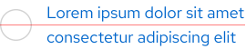

<link rel="stylesheet" data-helmet href="/assets/packages/@rhds/elements/elements/rh-table/rh-table-lightdom.css">
<link rel="stylesheet" data-helmet href="/styles/samp.css">

## Overview

Link with icon features an icon that adds context to the link itself. It’s 
positioned to the left or on top of a link, depending on orientation.

## Sample pattern

<uxdot-example width-adjustment="484px">
  
</uxdot-example>

## Style

Link with icon is available in light and dark themes. It’s a grouping of a small 
icon near a link, similar to how a list item is a grouping of a bullet point 
near text. The icon chosen should represent what a user will get when they click 
on or tap the link. It acts as a functional addition instead of only visual.

<uxdot-example width-adjustment="484px">
  
</uxdot-example>

### Theme

<uxdot-example width-adjustment="484px">
  
</uxdot-example>

<uxdot-example color-palette="darkest" width-adjustment="484px">
  
</uxdot-example>

## Usage

Use link with icon to increase the visual interest of a link without using a 
call to action style. Link with icon can replace links that are used on their 
own, but not in a paragraph of text.

## Best practices

Don't increase the icon size because the link text size will appear smaller.

<uxdot-example width-adjustment="484px" danger>
  
</uxdot-example>

## Behavior

### Responsive design

Link with icon can be used on large and small screens. When the width of the 
link exceeds the width of its container, the text will break to two lines.

<uxdot-example width-adjustment="1000px" variant="full" alignment="left" no-border>
  
</uxdot-example>

<figure>
  <uxdot-example width-adjustment="360px" variant="full" alignment="left" no-border>
    
  </uxdot-example>
  <figcaption>Some text styles reduce in size on small screens. Learn more about typography on mobile</figcaption>
</figure>

### Alignment

The icon and the link are always vertically-aligned.

<uxdot-example width-adjustment="269px">
  
</uxdot-example>

<uxdot-example width-adjustment="269px">
  
</uxdot-example>

## Interaction states

The link has the same interaction states as a Link whereas the icon doesn't have 
any interaction states.

## Spacing

Link with icon uses [space tokens](/tokens/space/) to define spacing values 
between elements.

<uxdot-example width-adjustment="484px">
  
</uxdot-example>

<rh-table>

</rh-table>


