<link rel="stylesheet" data-helmet href="/assets/packages/@rhds/elements/elements/rh-table/rh-table-lightdom.css">
<link rel="stylesheet" data-helmet href="/styles/samp.css">

## Overview

Links are navigational elements that allow a user to move between content,
pages, and websites.

## Sample pattern

<uxdot-example width-adjustment="259px">
  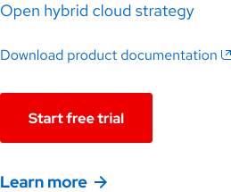
</uxdot-example>

## Demo

View a live version of the Call to action link and see how it can be customized.

<rh-cta href="/elements/call-to-action/">Customize component via Elements</rh-cta>

## Style

<uxdot-example width-adjustment="630px">
  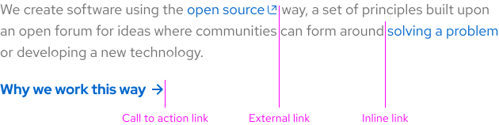
</uxdot-example>

### Variants

There are two link variants available for use.

- **Inline** - An Inline link can be used inside of text or a paragraph and allows a user to take a less important action.
- **Call to action** - A Call to action link can be used solo or near content and allows a user to take an important action.

### Visual elements

Each link variant has different styles depending on how they are used with or without content.

- **Inline link** - Text with or without color or an underline.
- **External link** - Text with an external link icon to the right.
- **Primary or Secondary call to action link** - Bolded text inside of a background or border container.
- **Default call to action link** - Bolded text with an arrow or icon to the right.

<rh-alert state="info">
  <h4 slot="header">Helpful tip</h4>
  
Visit the <a href="/elements/call-to-action/">Call to action</a> component page to see all available styles.

</rh-alert>

<uxdot-example width-adjustment="584px">
  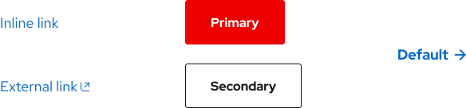
</uxdot-example>

### Text size

An Inline link can be applied to text used on its own at any size outside of a paragraph. When applied to text inside of a paragraph, it should match the size of the existing text.

<rh-alert state="info">
  <h4 slot="header">Helpful tip</h4>
  
Visit the <a href="/foundations/typography/">Typography</a> page to see available text sizes.

</rh-alert>

## Theme

### Light theme

<rh-alert state="info">
  <h4 slot="header">Helpful tip</h4>
  
Visit the <a href="/elements/call-to-action/">Call to action</a> component page to see light theme examples.

</rh-alert>

<uxdot-example width-adjustment="770px">
  
</uxdot-example>

### Dark theme

<rh-alert state="info">
  <h4 slot="header">Helpful tip</h4>
  
Visit the <a href="/elements/call-to-action/">Call to action</a> component page to see dark theme examples.

</rh-alert>

<uxdot-example color-palette="darkest" width-adjustment="770px">
  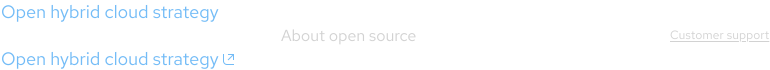
</uxdot-example>

## Usage

Links should be applied when a user needs to jump to content on the same page,
visit a page within the same domain, or visit a page within another domain.

<uxdot-example width-adjustment="752px">
  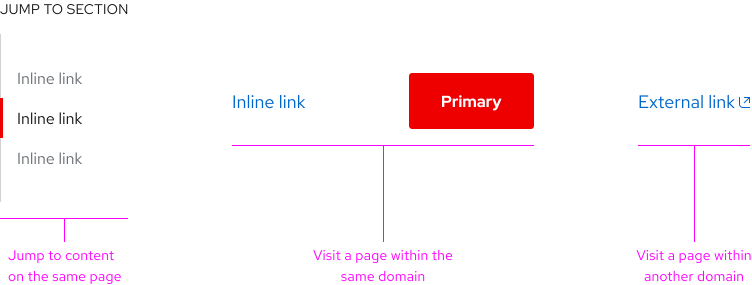
</uxdot-example>

### Content

Links are navigational elements, so any text needs to **accurately communicate
the destination**. Inconsistent experiences might lead to distrust, lessening
the satisfaction of a user during their journey. When writing link content,
Inline links should be **descriptive** to help a user better understand the
destination whereas Call to action links should be **action-oriented** to entice
a user to make a selection.

<rh-alert state="warning">
  <h4 slot="header">Warning</h4>
  
Link content needs to be written clearly in order to be understood, therefore write <strong>no more than four or five words</strong> per link.

</rh-alert>

<uxdot-example width-adjustment="840px">
  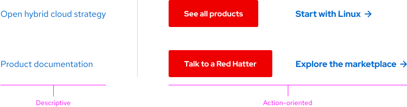
</uxdot-example>

### Character count

There is no maximum character count for a link. The link text should be long
enough to be descriptive and no longer.

### Images

Photos or images can be links as long as there is supporting content nearby
explaining that a selection can be made, like a headline, content, or Call to
action link. Do not hide links in photos or images otherwise a user will miss
the opportunity to make a selection if they cannot see the link.

### Buttons

Do not apply a link to an action that needs to be triggered instead, like
submitting a form or changing a state.

<rh-alert state="default">
  <h4 slot="header">Learn more</h4>
  
Visit the <a href="/elements/button/">Button</a> or <a href="./patterns/form/">Form</a> component pages to learn more about how to use buttons and forms.

</rh-alert>

<rh-alert state="info">
  <h4 slot="header">Helpful tip</h4>
  
In a form, selecting a button will trigger an action whereas selecting a link will direct a user to another page.

</rh-alert>

<uxdot-example width-adjustment="492px">
  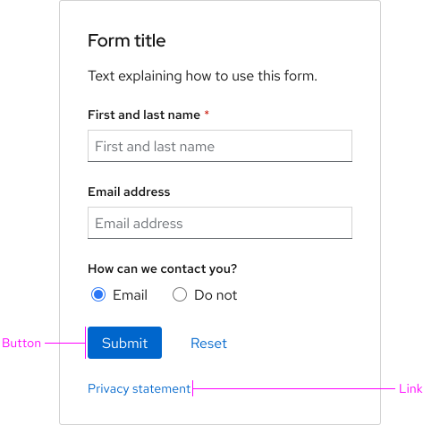
</uxdot-example>

## Behavior

### Internal pages

If a user selects a link within [redhat.com](https://www.redhat.com/en), they
should be directed to content within the redhat.com domain. In this situation, a
new tab or window is **not opened.**

### External pages

A user will be directed to another domain if they select an Inline link with an
**external link icon**. For example, if a user needs to be directed to another
website with different content or to complete a separate task, a new tab or
window (depending on how their browser is configured) is opened so they may
complete that task and then return to their original task.

<rh-alert state="info">
  <h4 slot="header">Helpful tip</h4>
  
Only Inline links can display an external link icon.

</rh-alert>

<rh-alert state="warning">
  <h4 slot="header">Warning</h4>
  
If navigating to a new page in the same tab is very disruptive to the experience or workflow, have the page open in a new tab or window instead.

</rh-alert>

<uxdot-example width-adjustment="508px">
  
</uxdot-example>

## Interaction states

<rh-alert state="info">
  <h4 slot="header">Helpful tip</h4>
  
Visit the <a href="/elements/call-to-action/">Call to action</a> component page to see available interaction states.

</rh-alert>

### Link

<uxdot-example width-adjustment="772px">
  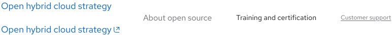
</uxdot-example>

<uxdot-example color-palette="darkest" width-adjustment="772px">
  
</uxdot-example>

### Hover

<uxdot-example width-adjustment="772px">
  
</uxdot-example>

<uxdot-example color-palette="darkest" width-adjustment="772px">
  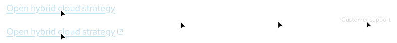
</uxdot-example>

### Focus

<uxdot-example width-adjustment="772px">
  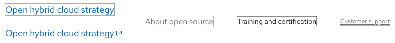
</uxdot-example>

<uxdot-example color-palette="darkest" width-adjustment="772px">
  
</uxdot-example>

### Active

<uxdot-example width-adjustment="772px">
  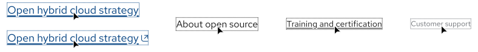
</uxdot-example>

<uxdot-example color-palette="darkest" width-adjustment="772px">
  
</uxdot-example>

### Visited

<rh-alert state="info">
  <h4 slot="header">Helpful tip</h4>
  
A popover trigger can be a linked text, or it can be an icon. For example, when a popover is needed near a form field, using the question mark icon as a trigger is common, but utilizing it is not always a requirement.

</rh-alert>

<uxdot-example width-adjustment="531px">
  
</uxdot-example>

<uxdot-example color-palette="darkest" width-adjustment="531px">
  
</uxdot-example>

### Tab order

When the Tab key is pressed repeatedly, the focus highlights each Inline and
Call to action link in order, from left to right and top to bottom.

<uxdot-example width-adjustment="666px">
  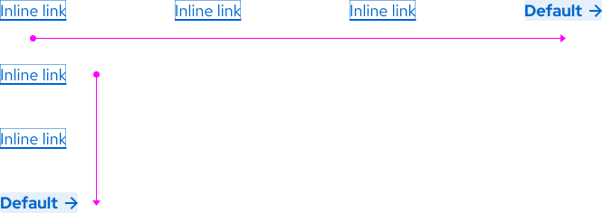
</uxdot-example>

### Accessibility

<rh-table>

| Key                    | Action                                |
| ---------------------- | ------------------------------------- |
| <kbd>Tab</kbd>         | Moves the focus to the next link.     |
| <kbd>Shift + Tab</kbd> | Moves the focus to the previous link. |
| <kbd>Enter</kbd>       | Selects the link with focus.          |

</rh-table>

## Responsive design

Both link variants mostly remain the same on large and small screens. Inline
links will break to two lines if there is a lot of text in the paragraph.

### Desktop

<uxdot-example width-adjustment="1000px" variant="full" alignment="left" no-border>
  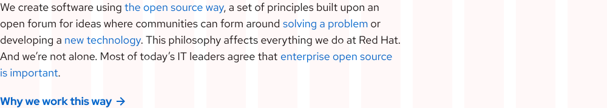
</uxdot-example>

### Tablet

<uxdot-example width-adjustment="768px" variant="full" alignment="left" no-border>
  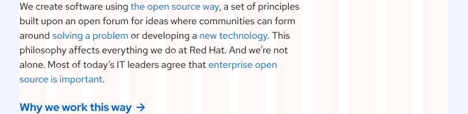
</uxdot-example>

### Mobile

<uxdot-example width-adjustment="360px" variant="full" alignment="left" no-border>
  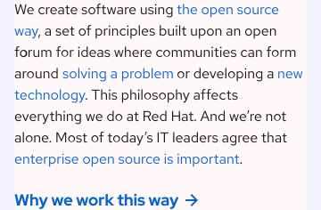
</uxdot-example>

## Best practices

### Too many links

Do not apply lots of links to paragraph text otherwise a user will have trouble
reading the content in its entirety before making a selection.

<uxdot-example width-adjustment="561px" danger>
  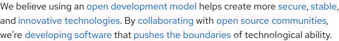
</uxdot-example>

### Different link variants

Do not use different link variants to direct a user to the same page.

<uxdot-example width-adjustment="561px" danger>
  
</uxdot-example>

### Ambiguity

When writing link content, avoid ambiguous phrases or a full website URL. A user
should have a clear idea of where they are being directed to before they make a
selection.

<uxdot-example width-adjustment="455px" danger>
  
</uxdot-example>

### Long links

Do not apply links to long strings of text.

<uxdot-example width-adjustment="561px" danger>
  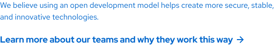
</uxdot-example>

### Buttons

Buttons have different use cases and should not be used to promote offers or
other content.

<rh-alert state="info">
  <h4 slot="header">Helpful Tip</h4>
  
Visit the <a href="/elements/button/">Button</a> component page to learn more about how to use buttons.

</rh-alert>

<uxdot-example width-adjustment="309px" danger>
  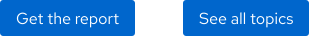
</uxdot-example>

### External link icon

Do not apply the external link icon to Call to action links.

<rh-alert state="info">
  <h4 slot="header">Helpful tip</h4>
  
Visit the <a href="/elements/call-to-action/">Call to action</a> component page to learn more about how to use calls to action.

</rh-alert>

<uxdot-example width-adjustment="398px" danger>
  
</uxdot-example>

### Widows

The Default call to action link arrow and the external link icon should not
appear by themselves, they should always be connected to at least one word on
the same line.

<uxdot-example width-adjustment="360px" danger>
  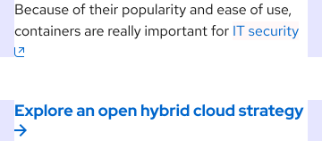
</uxdot-example>

## Spacing

<rh-alert state="info">
  <h4 slot="header">Helpful tip</h4>
  
Visit the <a href="/foundations/spacing/">Spacing</a> page to see spacing values between link variants and other elements.

</rh-alert>


