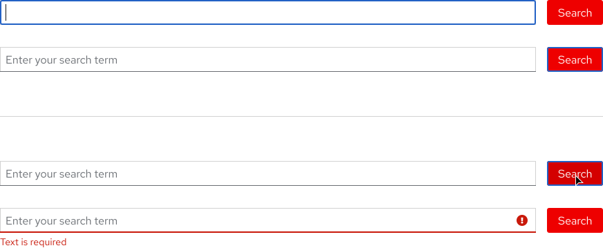

<link rel="stylesheet" data-helmet href="/assets/packages/@rhds/elements/elements/rh-table/rh-table-lightdom.css">
<link rel="stylesheet" data-helmet href="/styles/samp.css">

## Overview

A Search bar is a horizontal grouping of a form field with placeholder text and
a button. It allows a user to input text and then perform a search.

## Sample pattern

<uxdot-example width-adjustment="1000px">
  
</uxdot-example>

## Style

A search bar includes a narrow but wide form field with placeholder text and a
red button that is placed on the right.

<uxdot-example width-adjustment="872px">
  
</uxdot-example>

#### Button

A search bar includes a button so a user can perform a search. A call to action
link would only direct a user to a results page without actually performing a
search, so a button must be used instead.

<rh-alert state="info">
  <h4 slot="header">Learn more</h4>
  
Visit the <a href="/elements/button/">Button</a> or
     <a href="/elements/call-to-action/">Call to action</a> element pages to
     learn more about how to use buttons and calls to action.

</rh-alert>

<uxdot-example width-adjustment="262px">
  
</uxdot-example>

## Theme

#### Light theme

The light theme search bar includes a light theme form field and red button.

<uxdot-example width-adjustment="872px">
  
</uxdot-example>

#### Dark theme

For now, the light theme search bar can also be used in the dark theme.

<uxdot-example color-palette="darkest" width-adjustment="872px">
  
</uxdot-example>

## Usage

A search bar is best used to give a user the ability to search for something and
then display any relevant search results.

#### Layout

A search bar can be used in most layouts. It has no set width other than the
boundaries of whatever container or grid it is placed in.

<uxdot-example width-adjustment="872px">
  
</uxdot-example>

#### Content

The text within a search bar indicates how wide or narrow a search will be. If
the text is <em>*generic*</em> (Enter your search term), a user might expect to
search through an entire website. If the text is *specific* (Search all
resources), a user might expect to search through an individual page.

<uxdot-example width-adjustment="872px">
  
</uxdot-example>

## Behavior

#### Form field

When a user selects the form field to input text via cursor or keyboard, the
placeholder text will disappear, the form field will have focus, and a blinking
cursor will take its place. When a user starts typing, the text styling will
change.

<rh-alert state="info">
  <h4 slot="header">Learn more</h4>
  
Visit the <a href="/patterns/form/">Form</a> pattern page to learn more about form fields.

</rh-alert>

<uxdot-example width-adjustment="872px">
  
</uxdot-example>

#### Typeahead

Typeahead allows a user to narrow down a displayed list of options when they
input text within a form field, it is recommended for lists with more than 10
options.

<uxdot-example width-adjustment="872px">
  
</uxdot-example>

#### Errors

If focus is moved from the form field to the button, an error will not be
displayed. However, if a user tries to perform a search without any text in the
form field, an error will be displayed.

<rh-alert state="info">
  <h4 slot="header">Learn more</h4>
  
Visit the <a href="/patterns/form/">Form</a> pattern page to learn more about form field errors.

</rh-alert>

<uxdot-example width-adjustment="872px">
  
</uxdot-example>

## Interaction states

<rh-alert state="info">
  <h4 slot="header">Learn more</h4>
  
Visit the <a href="/patterns/form/">Form</a> or
     <a href="/elements/button/">Button</a> pages to learn more about
     interaction states.

</rh-alert>

#### Link

<uxdot-example width-adjustment="872px">
  
</uxdot-example>

#### Hover

A blue line appears at the bottom of the form field indicating it is selectable.

<uxdot-example width-adjustment="872px">
  
</uxdot-example>

#### Focus

When the focus is moved to the form field via keyboard, the placeholder text
will disappear and a blinking cursor will take its place. When the focus is
moved away, the placeholder text will be visible again.

<uxdot-example width-adjustment="872px">
  
</uxdot-example>

#### Active

When the focus is moved to the form field via cursor, the placeholder text will
disappear and a blinking cursor will take its place. When the focus is moved
away, the placeholder text will be visible again.

<uxdot-example width-adjustment="872px">
  
</uxdot-example>

#### Tab order

When the Tab key is pressed repeatedly, the focus will highlight the form field
first and then the button. A user can move the focus from the form field to the
button without an error being displayed.

<uxdot-example width-adjustment="872px">
  
</uxdot-example>

## Accessibility

<rh-table>

| Key                               | Action                                                                            |
| --------------------------------- | --------------------------------------------------------------------------------- |
| <kbd>Tab</kbd>                    | Moves the focus to the button.                                                    |
| <kbd>Shift</kbd> + <kbd>Tab</kbd> | Moves the focus to the form field.                                                |
| <kbd>Enter</kbd> (if text)        | Triggers a search.                                                                |
| <kbd>Enter</kbd> (if no text)     | Displays an error icon and text requiring a user to input text in the form field. |

</rh-table>

## Responsive design

A search bar mostly remains the same on large and small screens. While it can
stretch horizontally to fit any container or grid, only the form field stretches
whereas the button always stays the same size.

#### Desktop

<uxdot-example width-adjustment="1000px" variant="full" alignment="left" no-border>
  
</uxdot-example>

#### Tablet

<uxdot-example width-adjustment="768px" variant="full" alignment="left" no-border>
  
</uxdot-example>

#### Mobile

<uxdot-example width-adjustment="360px" variant="full" alignment="left" no-border>
  
</uxdot-example>

## Best practices

#### Long placeholder text

Do not write placeholder text too long, it should be short and to the point
(maximum 30 characters).

<uxdot-example width-adjustment="872px" danger>
  
</uxdot-example>

#### Call to action as button

Do not replace the button with a call to action.

<uxdot-example width-adjustment="872px" danger>
  
</uxdot-example>

#### Different style or color

Do not use a different button color or style when using a search bar on Red Hat
*marketing* websites.

<uxdot-example width-adjustment="872px" danger>
  
</uxdot-example>

#### Disabled

Do not disable the button until a user inputs text in the form field. The button
should always be active and if a user tries to perform a search without any text
in the form field, an error should be displayed instead.

<uxdot-example width-adjustment="872px" danger>
  
</uxdot-example>

#### Solo button

Avoid using the search button on its own without a form field.

<rh-alert state="info">
  <h4 slot="header">Learn more</h4>
  
Visit the <a href="/elements/button/">Button</a> component page to learn more about how to use buttons.

</rh-alert>

<uxdot-example width-adjustment="81px" danger>
  
</uxdot-example>

#### Rearranging the component

Do not rearrange a search bar by placing the button below the form field or
changing its width.

<uxdot-example width-adjustment="360px" danger>
  
</uxdot-example>

## Spacing

A search bar uses [space tokens](/tokens/space/) to define spacing values
between elements.

<uxdot-example width-adjustment="872px">
  
</uxdot-example>

<rh-table>

</rh-table>


