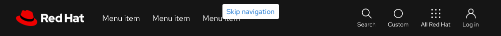
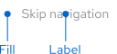
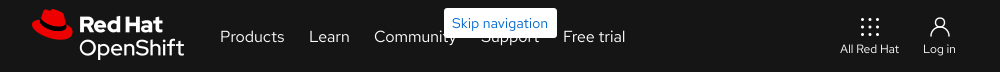
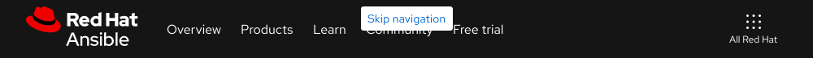
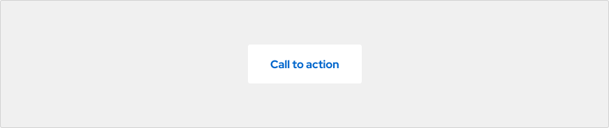
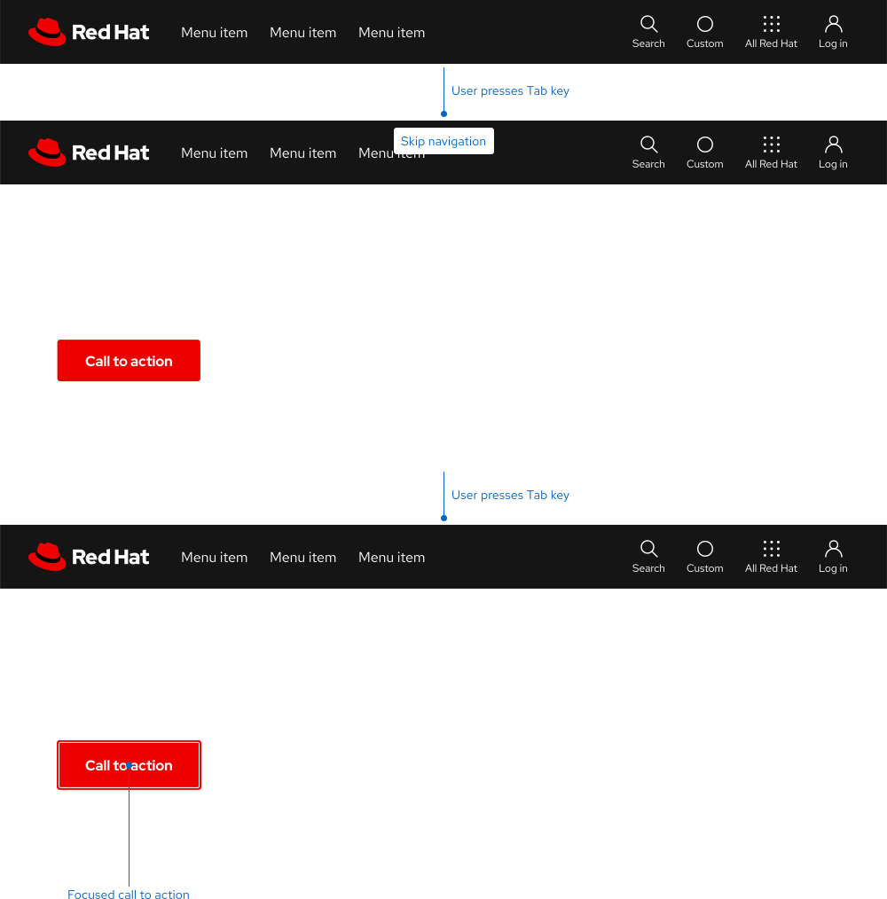
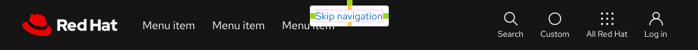

<link rel="stylesheet" data-helmet href="/assets/packages/@rhds/elements/elements/rh-table/rh-table-lightdom.css">
<link rel="stylesheet" data-helmet href="/styles/samp.css">

## Overview

Skip navigation is a styled link that appears at the top of a page when the Tab
key is pressed. It bypasses the navigation and jumps users down to the main
content when selected.

## Sample pattern

<uxdot-example width-adjustment="1000px">
  
</uxdot-example>

## Style

Skip to main content is a styled link that consists of a text label and a
background container. Even though it looks like a Button, it functions more like
a jump link.

<uxdot-example color-palette="lighter" width-adjustment="129px" no-border>
  
</uxdot-example>

## Usage

A skip to main content link helps some users browse the web more effectively. It
should be invisible on every page as a commitment to accessibility.

<uxdot-example width-adjustment="1000px" variant="full" alignment="left" no-border>
  
</uxdot-example>

<uxdot-example width-adjustment="1000px" variant="full" alignment="left" no-border>
  
</uxdot-example>

<uxdot-example width-adjustment="1000px" variant="full" alignment="left" no-border>
  
</uxdot-example>

## Best practices

Don't apply the skip to main content link style to other components.

<uxdot-example width-adjustment="872px" danger>
  
</uxdot-example>

## Behavior

When a user presses the Tab key upon page load, the skip to main content link
will appear centered at the top above the navigation. When a user presses the
Enter key, the page will move down and the focus indicator should highlight the
main content.

<uxdot-example width-adjustment="1000px" variant="full" alignment="left" no-border>
  
</uxdot-example>

## Spacing

A skip to main content link  uses [space tokens](/tokens/space/) to define spacing
values between elements.

<uxdot-example width-adjustment="1000px">
  
</uxdot-example>

<rh-table>

</rh-table>


