<link rel="stylesheet" data-helmet href="/assets/packages/@rhds/elements/elements/rh-table/rh-table-lightdom.css">
<link rel="stylesheet" data-helmet href="/styles/samp.css">

## Overview

A Sticky banner slides into view at a certain scroll position and then anchors
itself to the bottom edge of a browser window. It stays in one place as content
scrolls underneath until a user dismisses them.

## Sample pattern

<uxdot-example width-adjustment="340px">
  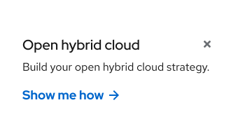
</uxdot-example>

## Style

A sticky banner can be used in the light theme only. The large size can include
a thumbnail image on large screens, but both sizes can include a headline, text,
a call to action, and a background container with a subtle drop shadow. A close
button also needs to be included in both sizes.

<uxdot-example width-adjustment="884px">
  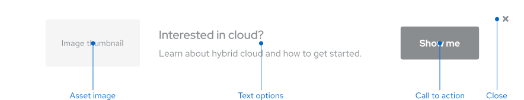
</uxdot-example>

### Sizes

Large and Small are the two sticky banner sizes. The large size spans the
full-width of the browser window and therefore can’t have rounded corners. The
small size is fixed width and features rounded corners on top. The large size
can feature more than the small size as well, including a thumbnail image, more
text, and a larger call to action.

<uxdot-example width-adjustment="1000px" variant="full" alignment="left" no-border>
  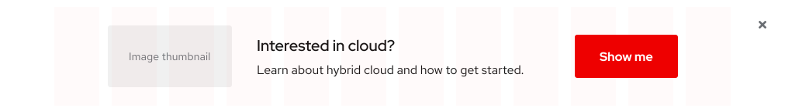
</uxdot-example>

<uxdot-example width-adjustment="360px" variant="full" alignment="left" no-border>
  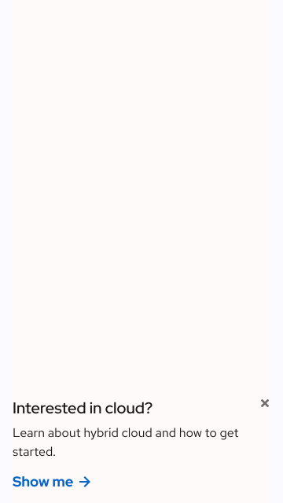
</uxdot-example>

### Content

Content in the large size falls within the 12-column grid whereas content in the
small size is determined by the width of the banner container.

### Call to action

The large sticky banner features a Primary call to action and the small sticky
banner features a Default call to action. The large size should have a Primary
call to action, even if the same style is present somewhere else on the page.
The banner is shown after a user has scrolled past the hero to avoid displaying
two Primary calls to action simultaneously.

## Usage

A sticky banner is used on the bottom of pages where a secondary or personalized
offer can be shown to users without interrupting their experience.

### Large vs. small

The large sticky banner can be used to promote an important offer on most
websites, like the home page. The small sticky banner can be used to promote a
less important offer on specific websites, like a product or article page. The
importance of the asset determines the size of the sticky banner that’s used.

### Placement

A sticky banner is anchored on the bottom of the page where it doesn’t distract
a user from the page content. It can be used in light or dark environments
because it scrolls on top of content and the backgrounds contain a drop shadow
to help give it some depth. A user must close the Cookie banner for a sticky
banner to appear.

<uxdot-example width-adjustment="1000px" variant="full" alignment="left" no-border>
  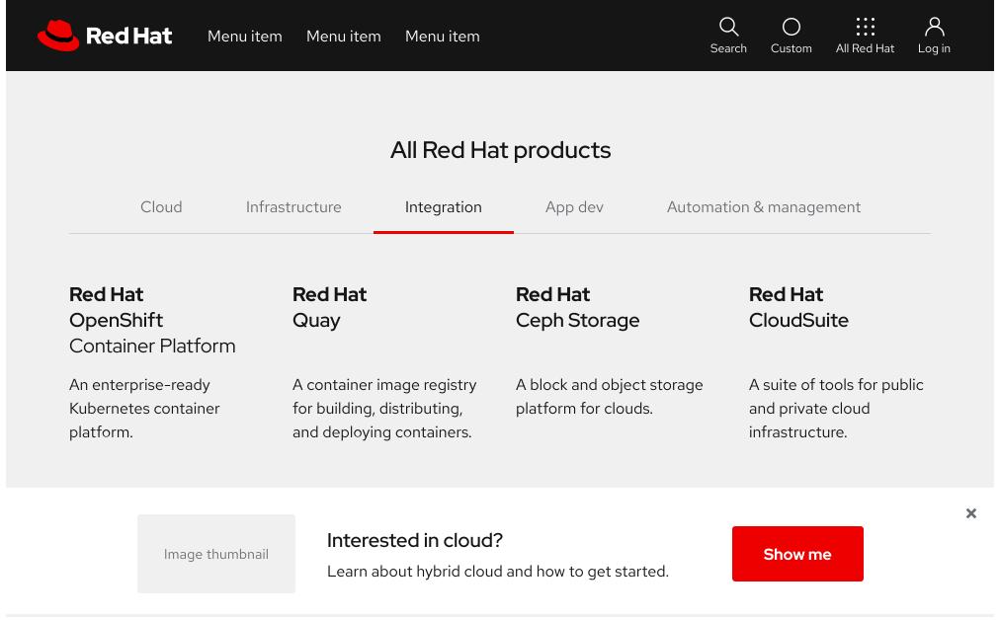
</uxdot-example>

<uxdot-example width-adjustment="360px" variant="full" alignment="left" no-border>
  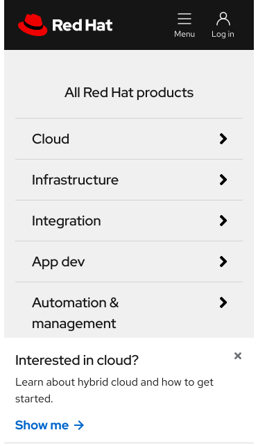
</uxdot-example>

### Layout

The large sticky banner background spans the width of a browser window. The
content inside falls within a 12-column grid on large screens and a one-column
grid on small screens.

### Content

A sticky banner has limited vertical height, so keep content short and only
include essential information. A sticky banner can include a thumbnail image, a
headline, text, and a call to action, but not all elements are required.

- The headline shouldn’t break to two lines on any screen size (35 - 40 characters)
- The text shouldn’t break to three lines on any screen size (85 - 110 characters)
- A sticky banner should clearly describe what a visitor is getting if they choose to continue
- The thumbnail image, headline, text, and call to action should all align to the specific resource that’s being promoted<

## Best practices

Don't change the large sticky banner to be fixed width.

<uxdot-example width-adjustment="872px" danger>
  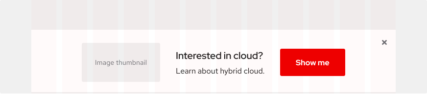
</uxdot-example>

Don’t omit the thumbnail image from the sticky banner on large screens like
Desktop or Tablet, landscape, it helps users get a better idea of what they’re
downloading.

<uxdot-example width-adjustment="884px" danger>
  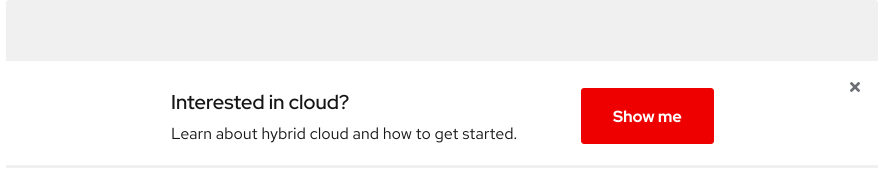
</uxdot-example>

Don’t omit the drop shadow because the banner will blend into the background.

<uxdot-example width-adjustment="872px" danger>
  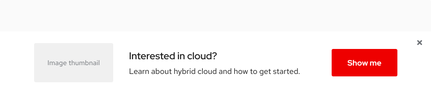
</uxdot-example>

## Behavior

The behavior of a sticky banner is similar to a Sticky card, they stick to the
edge of a browser window and remain there until a user dismisses them. The
difference is that a sticky banner is conversion-driven, they promote a more
important offer that drives a user to a landing page whereas a sticky card
promotes a less important offer like a resource or webinar.

<uxdot-example width-adjustment="1000px">
  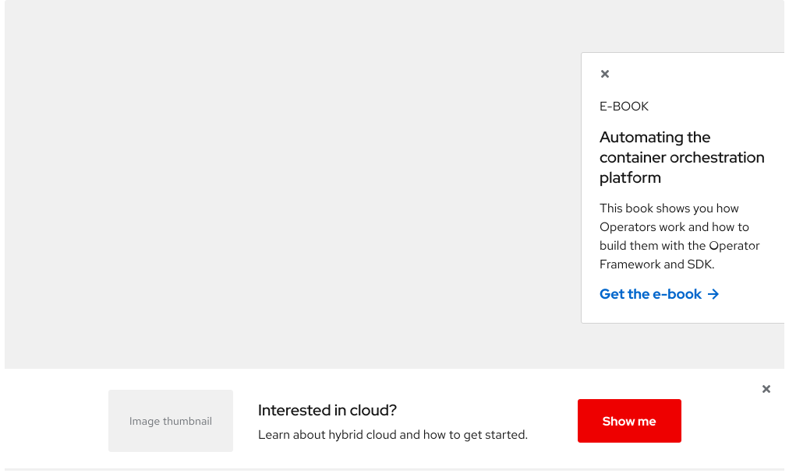
</uxdot-example>

### Sliding

A sticky banner slides into view when a user reaches a specific scroll position
on a page, usually somewhere below the fold.

### Dismissing

A user can click on or tap the close button if they want to dismiss a sticky
banner from their view. The page’s scroll position won’t be impacted and the
sticky banner won’t return in the same browsing session after it’s closed.

## Responsive design

### Breakpoints

A sticky banner can work on both large and small screens. Some elements will be
dropped when space reduces to keep the layout clean and organized.

### Desktop

<uxdot-example width-adjustment="1000px" variant="full" alignment="left" no-border>
  
</uxdot-example>

### Tablet

<uxdot-example width-adjustment="768px" variant="full" alignment="left" no-border>
  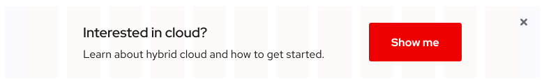
</uxdot-example>

### Mobile, landscape

<figure>
  <uxdot-example width-adjustment="360px" variant="full" alignment="left" no-border>
    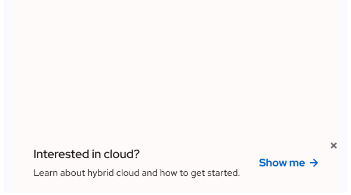
  </uxdot-example>
  <figcaption>Some text styles reduce in size on small screens. Learn more about
    typography on mobile.</figcaption>
</figure>

### Mobile, portrait

<uxdot-example width-adjustment="372px" variant="full" alignment="left" no-border>
  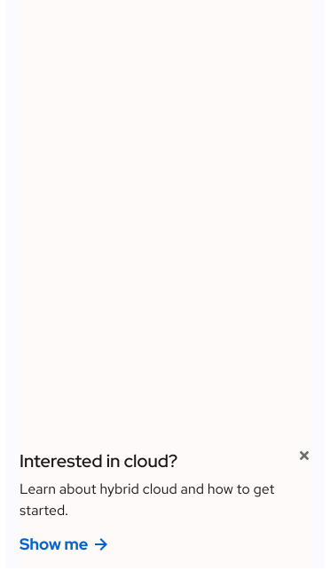
</uxdot-example>

## Interaction states

Since a sticky banner can consist of a variety of elements, refer to the
specific interaction states that are assigned to each style and component for
more information.

## Spacing

Both sticky banners use [space tokens](/tokens/space/) to define spacing values
between elements.

### Large size

<uxdot-example width-adjustment="884px">
  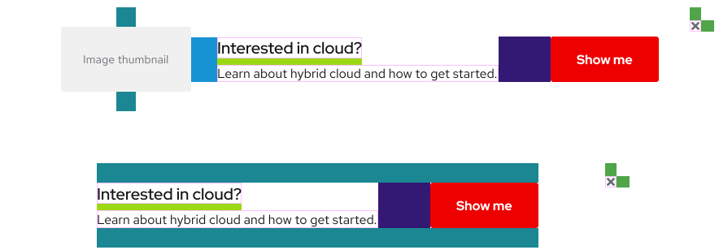
</uxdot-example>

### Small size

Content padding defines how far away elements are from each other inside each
section.

<uxdot-example width-adjustment="588px">
  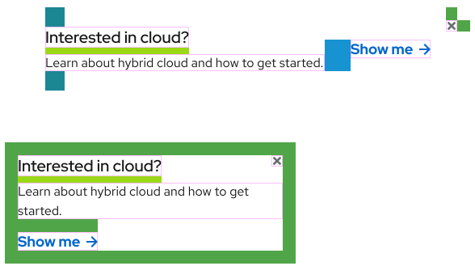
</uxdot-example>

<uxdot-spacer-tokens-table tokens="md, lg, xl, 2xl, 3xl, 4xl"></uxdot-spacer-tokens-table>


