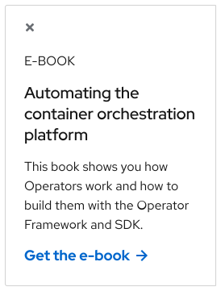

<link rel="stylesheet" data-helmet href="/assets/packages/@rhds/elements/elements/rh-table/rh-table-lightdom.css">
<link rel="stylesheet" data-helmet href="/styles/samp.css">

## Overview

Sticky cards slide into view at a certain scroll position and then anchor
themselves to the edge of a browser window. They stay in one place as content
scrolls underneath until a user dismisses them.

## Sample pattern

<uxdot-example width-adjustment="274px">
  
</uxdot-example>

## Style

A sticky card acts as a small container for a limited amount of content.

<uxdot-example width-adjustment="453px">
  
</uxdot-example>

### Theme

The required elements in a sticky card are a close button, a title or a
headline, a call to action, and a container (the light theme container features
a drop shadow). The container consists of a background color and two rounded
corners on the left or the right side, depending on the orientation. A thin
border is also required even if the sticky card background color is different
than the page background color.

<uxdot-example width-adjustment="277px">
  
</uxdot-example>

<uxdot-example color-palette="darkest" width-adjustment="262px">
  
</uxdot-example>

### Layout

A sticky card features header, body, and footer sections, just like a normal
Card. Header, body, and footer sections can only include a limited amount of
content to ensure that the card doesn’t become too tall.

### Close button

A close button is required for accessibility if a user wants to dismiss the
sticky card from their view if they find it distracting.

### Header

The header section can feature only a limited amount of content like a card
title or a small headline. This required section introduces what the content is
and shouldn’t be hidden.

### Body

To keep the vertical height short, the body section can only include a small
amount of text or a small image thumbnail. If a card title and a headline are
enough to explain what the content is, the body section can be hidden.

### Footer

The footer section can include normal links or a call to action. A sticky card
footer is always required and shouldn't be hidden.

<uxdot-example width-adjustment="713px">
  
</uxdot-example>

## Usage

The sticky card placement is different than the normal card placement, where a
normal card lives in a predetermined spot on a page. A sticky card slides into
view only when a user reaches a specific scroll position on a page. When it
does, it stays fixed to the edge of the page and it floats above content and
layouts when a user scrolls. It should only be used to feature secondary content
that’s helpful to a user, like a resource or webinar.

### Layout

A sticky card can be placed on the left or the right edge of a page and it has a
fixed width of 262px.

<uxdot-example width-adjustment="879px">
  
</uxdot-example>

### Content

A sticky card has limited vertical height, so keep content short and only
include essential information. A sticky card can include a card title, a
headline, text, and a call to action, but not all of these elements need to be
included at the same time. Move any extra content to other parts of the page if
possible.

<uxdot-example width-adjustment="596px">
  
</uxdot-example>

### Character count

The recommended maximum character count for the elements of a sticky card are
listed below and include spaces.

<rh-table>

| Element   | Character count |
|-----------|-----------------|
| Title     | 20              |
| Headline  | 50              |
| Body text | 120             |
| Footer    | 55              |

</rh-table>

### Alignment

Text and other content in a sticky card is always left-aligned, even if the
sticky card is anchored to the right edge of a page.

## Best practices

Don’t use more than one sticky card per page.

<uxdot-example width-adjustment="751px" danger>
  
</uxdot-example>

Don’t change the width of a sticky card on large screens, it’s fixed at 262px.

<uxdot-example width-adjustment="375px" danger>
  
</uxdot-example>

Don’t anchor a sticky card on small screens, it covers too much content.

<uxdot-example width-adjustment="386px" danger>
  
</uxdot-example>

Don't omit the close button, it’s needed for accessibility.

<uxdot-example width-adjustment="277px" danger>
  
</uxdot-example>

Don’t use more than one call to action.

<uxdot-example width-adjustment="277px" danger>
  
</uxdot-example>

## Behavior

### Sliding

A sticky card is always hidden until it slides into view. The trigger is when a
user reaches a specific scroll position on a page, which should be below the
fold to avoid distracting a user as soon as a page loads.

### Scrolling

A sticky card can be anchored to the left or the right edge of a page and it
stays in the same position when a user scrolls up or down. Any content below
will scroll underneath, but it will be partially covered.

### Dismissing

A user can click on or tap the close button if they want to dismiss the sticky
card from their view. The page’s scroll position won’t be impacted and the
sticky card won’t return in the same browsing session after it’s closed.

### Vertical height

The vertical height of a sticky card greatly expands when too much content is
placed inside. Doing this will cover too much content and negatively impact the
user experience, so keep the content short to maintain as close to a square
aspect ratio as possible.

<uxdot-example width-adjustment="603px">
  
</uxdot-example>

## Breakpoints

A sticky card is 262px wide on large screens only. On small screens, it acts
like a normal card and is placed in a predetermined spot on a page, but it
maintains the same styles.

### Desktop

<uxdot-example width-adjustment="1000px" variant="full" alignment="left" no-border>
  
</uxdot-example>

### Tablet

<uxdot-example width-adjustment="775px" variant="full" alignment="left" no-border>
  
</uxdot-example>

### Mobile

<uxdot-example width-adjustment="360px" variant="full" alignment="left" no-border>
  
</uxdot-example>

## Interaction states

Since a sticky card can consist of a variety of elements, refer to the specific
interaction states that are assigned to each style and component for more
information.

## Spacing

A sticky card uses [space tokens](/tokens/space/) to define spacing
values between elements.

<uxdot-example width-adjustment="287px">
  
</uxdot-example>

<rh-table>

</rh-table>


