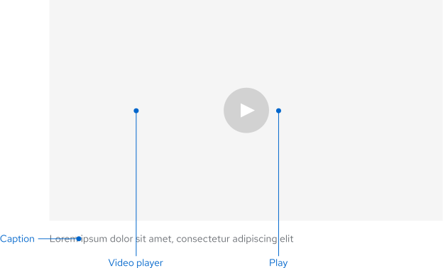
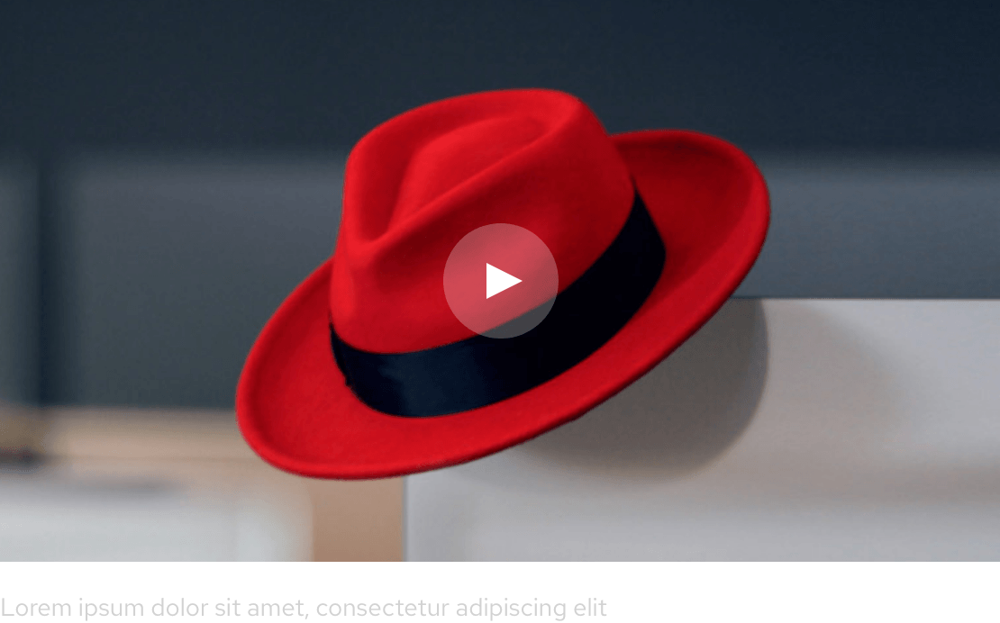
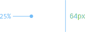
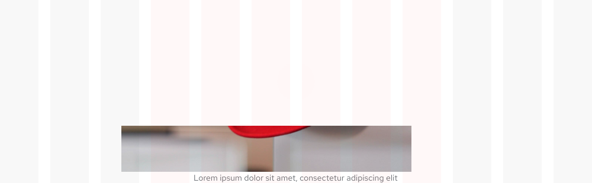
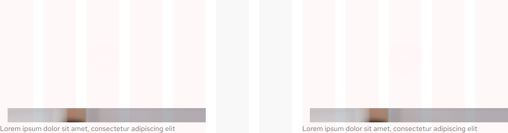
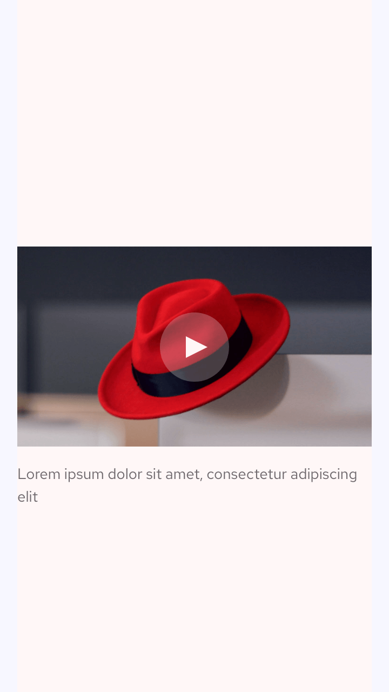
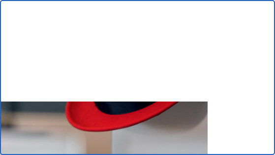
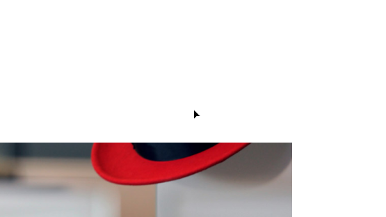

<link rel="stylesheet" data-helmer href="/assets/packages/@rhds/elements/elements/rh-table/rh-table-lightdom.css">
<link rel="stylesheet" data-helmer href="/styles/samp.css">

## Overview

A Video thumbnail is a graphical preview of a video overlayed with a play
button. When it’s selected, a video player modal will be displayed so a user can
watch the video at a larger size.

## Sample pattern

<uxdot-example width-adjustment="555px">
  
</uxdot-example>

## Style

A video thumbnail is a combination of a graphic with a slightly transparent play
button on top. A video thumbnail can also include an optional caption underneath
that explains what the video is.

<uxdot-example width-adjustment="624px">
  
</uxdot-example>

## Theme

<uxdot-example color-palette="light" width-adjustment="870px">
  
</uxdot-example>

<uxdot-example color-palette="darkest" width-adjustment="870px">
  
</uxdot-example>

### Button

A video thumbnail can include either a light or a dark play button, depending on
the image underneath. If an image is lighter, use a dark play button for
accessibility and vice versa.

  <uxdot-example width-adjustment="172px">
    
  </uxdot-example>

  <uxdot-example color-palette="darkest" width-adjustment="172px">
    
  </uxdot-example>

## Usage

A video thumbnail can be used to indicate that a video can be played and using a
caption underneath isn’t required.

### Layouts

A video thumbnail can be used in most layouts that have enough space to
accommodate a small image with a play button on top. A video thumbnail used in a
card is a good example of a minimum size.

<uxdot-example width-adjustment="487px">
  
</uxdot-example>

### Caption

An optional descriptor caption can be placed underneath the video thumbnail, it
can be left- or center-aligned, depending on how the video is oriented.

### Character counts

A caption should be limited to 150 characters.

## Best practices

Don't reposition the play button.

<uxdot-example width-adjustment="555px" danger>
  
</uxdot-example>

Don't change the aspect ratio of a video thumbnail.

<uxdot-example width-adjustment="555px" danger>
  
</uxdot-example>

## Behavior

### Modal

When a video thumbnail is smaller than six columns, selecting the play button
triggers a [Video player modal](../modal) where a larger version of the video
will play on top of a background overlay.

### Inline

When a video thumbnail is larger than six columns, the video will play inline on
the page.

## Responsive design

A video thumbnail changes size, but it should maintain its aspect ratio across
all screen sizes. The caption also maintains the same text size, but changes
alignment to match the video thumbnail.

### Desktop, centered

<uxdot-example width-adjustment="1000px" variant="full" alignment="left" no-border>
  
</uxdot-example>

When centered, the video thumbnail and caption should span six grid columns

<uxdot-example width-adjustment="1000px" variant="full" alignment="left" no-border>
  
</uxdot-example>

When aligned on the left or right edge of the grid, the video thumbnail and
caption should span five grid columns

### Mobile

<uxdot-example width-adjustment="360px" variant="full" alignment="left" no-border>
  
</uxdot-example>

## Interaction states

The only interactive element in a video thumbnail is the play button. For more
information about modal interaction states, see [Video player modal](../modal).

### Default

<uxdot-example width-adjustment="555px">
  
</uxdot-example>

### Focus

<uxdot-example width-adjustment="555px">
  
</uxdot-example>

### Hover

<uxdot-example width-adjustment="555px">
  
</uxdot-example>

### Active

<uxdot-example width-adjustment="555px">
  
</uxdot-example>

  <figure>
    <uxdot-example width-adjustment="116px">
      
    </uxdot-example>
    <figcaption>The dark play button background becomes 25% darker on hover</figcaption>
  </figure>
  <figure>
    <uxdot-example color-palette="darkest" width-adjustment="116px">
      
    </uxdot-example>
    <figcaption>The light play button background becomes 25% lighter on hover</figcaption>
  </figure>

## Spacing

A video thumbnail uses [space tokens](/tokens/space/) to define spacing
values between elements.

<uxdot-example width-adjustment="1000px">
  
</uxdot-example>

<rh-table>
  
  
</rh-table>


