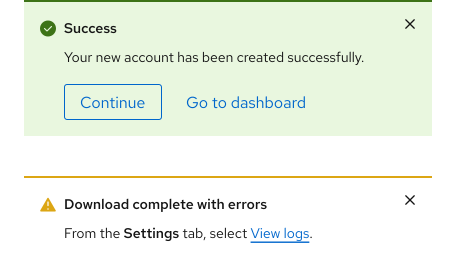

## Overview

{{ tagName | getElementDescription }}

<uxdot-example width-adjustment="456px">
  
</uxdot-example>



## Sample element

<rh-alert dismissable state="info">
  <h3 slot="header">Title</h3>
  
Lorem ipsum dolor sit amet, consectetur adipiscing elit.

  <rh-button slot="actions" data-action="dismiss" variant="secondary">Confirm</rh-button>
  <rh-button slot="actions" data-action="confirm" variant="link">Cancel</rh-button>
</rh-alert>

## When to use

  - Communicate essential information in a prominent way
  - Notify a user of a change in status
  - Communicate urgency using severity


