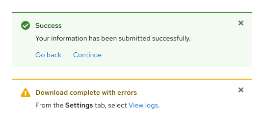

## Overview 
An Alert is a banner used to notify a user about a change in status or communicate other information. It can be generated with or without a user triggering an action first.


## Sample component

{style="--inline-img-max-width:538px;"}




  ## When to use
  - When additional information needs to be emphasized 
  - When a user needs to be notified after performing an action
  - When the severity of a message needs to be indicated



  ## Demos
  View a live version of this component and see how it can be customized.
  
  
    View the `<rh-alert>` demo in a new tab
  



