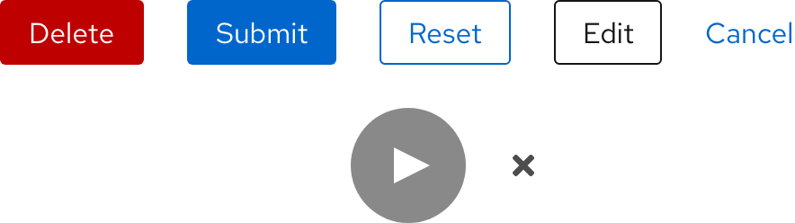

## Overview

{{ tagName | getElementDescription }}

<uxdot-example width-adjustment="442px">
  
</uxdot-example>



## Sample element

<rh-button>Primary</rh-button>

## When to use

  - When you need to allow users to interact with pages in a variety of ways
  - When you need to communicate actions users can take
  - When you need to draw attention to the highest priority action


