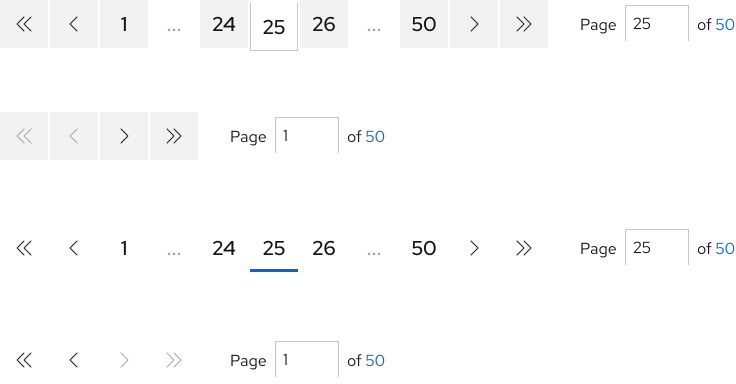

## Overview

{{ tagName | getElementDescription }}

Pagination allows users to navigate between pages of related content.

<uxdot-example width-adjustment="736px">
  
</uxdot-example>



## Sample element

<rh-pagination>
  <ol>
    <li><a href="#1">1</a></li>
    <li><a href="#2">2</a></li>
    <li><a href="#3">3</a></li>
    <li><a href="#4">4</a></li>
    <li><a href="#5">5</a></li>
  </ol>
</rh-pagination>

## When to use
  - When you need to divide large quantities of data or content into chunks
  - When you need to enable users to navigate to through pages or locate a specific page number
  - When you need to improve the loading performance of a system


