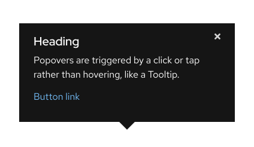

## Coming soon!

This element is currently in progress and not yet available for use.

## Overview

A Popover displays content in a non-modal dialog and adds contextual
information or provides resources via text and links.

 

## Sample element

<uxdot-example width-adjustment="424px">
  
</uxdot-example>


