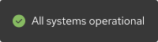

## Overview

{{ tagName | getElementDescription }}

<uxdot-example color-palette="darkest" width-adjustment="200px">
  
</uxdot-example>



## Sample element

<rh-site-status></rh-site-status>

## When to use

  - When you need to communicate the operational status of a website or domain
  - When you need to provide users with a link to a status page where they can learn more


