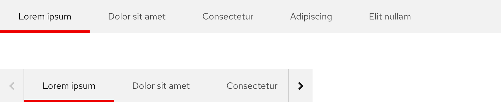

## Overview

{{ tagName | getElementDescription }}

<uxdot-example width-adjustment="872px">
  
</uxdot-example>



## Sample element

<rh-subnav>
  <a href="#" active>Lorem ipsum</a>
  <a href="#">Dolor sit amet</a>
  <a href="#">Consectetur</a>
  <a href="#">Adipiscing</a>
  <a href="#">Elit nullam</a>
</rh-subnav>

## When to use

  - When you need to connect a group of related pages together
  - When you need to offer users a more granular navigation
  - When you want to allow users to browse high-level and low-level pages in the 
    same experience


