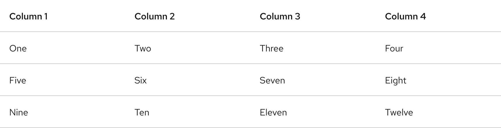

## Overview

{{ tagName | getElementDescription }}

<uxdot-example width-adjustment="872px">
  
</uxdot-example>



## Sample element

<rh-table>
  <table>
    <colgroup>
      <col>
      <col>
      <col>
      <col>
    </colgroup>
    <thead>
      <tr>
        <th scope="col" data-label="Column 1">Column 1</th>
        <th scope="col" data-label="Column 2">Column 2</th>
        <th scope="col" data-label="Column 3">Column 3</th>
        <th scope="col" data-label="Column 4">Column 4</th>
      </tr>
    </thead>
    <tbody>
      <tr>
        <td data-label="Column 1">One</td>
        <td data-label="Column 2">Two</td>
        <td data-label="Column 3">Three</td>
        <td data-label="Column 4">Four</td>
      </tr>
      <tr>
        <td data-label="Column 1">Five</td>
        <td data-label="Column 2">Six</td>
        <td data-label="Column 3">Seven</td>
        <td data-label="Column 4">Eight</td>
      </tr>
      <tr>
        <td data-label="Column 1">Nine</td>
        <td data-label="Column 2">Ten</td>
        <td data-label="Column 3">Eleven</td>
        <td data-label="Column 4">Twelve</td>
      </tr>
    </tbody>
  </table>
</rh-table>

## When to use

  - To organize and display structured data
  - If a user needs to scan, examine, and compare data
  - If a user must navigate to a specific piece of data to complete a task


