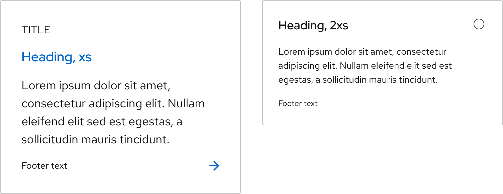

## Overview

{{ tagName | getElementDescription }}

<uxdot-example width-adjustment="752px">
  
</uxdot-example>



## Sample element

<rh-tile>
  
  
Title

  <h2 slot="headline"><a href="#top">Link</a></h2>
  Lorem ipsum dolor sit amet, consectetur adipiscing elit.
  
Suspendisse eu turpis elementum

</rh-tile>

## When to use

- When you need to group content in a linked container
- When you need an alternative to a group of cards with the same calls to action
- When you need to group content for a radio button or checkbox in a form



