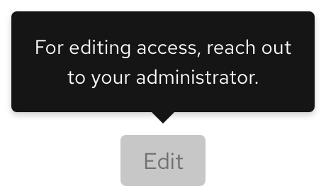

## Overview

{{ tagName | getElementDescription }}

<uxdot-example width-adjustment="230px">
  
</uxdot-example>



## Sample element

<rh-tooltip position="top">
  <rh-button>Top Tooltip</rh-button>
  Lorem ipsum dolor sit amet, consectetur adipiscing elit, sed do eiusmod tempor incididunt ut
    labore et dolore magna aliqua. Mi eget mauris pharetra et ultrices.
</rh-tooltip>
<rh-tooltip position="left">
  <rh-button>Left Tooltip</rh-button>
  Lorem ipsum dolor sit amet, consectetur adipiscing elit, sed do eiusmod tempor incididunt ut
    labore et dolore magna aliqua. Mi eget mauris pharetra et ultrices.
</rh-tooltip>
<rh-tooltip position="right">
  <rh-button>Right Tooltip</rh-button>
  Lorem ipsum dolor sit amet, consectetur adipiscing elit, sed do eiusmod tempor incididunt ut
    labore et dolore magna aliqua. Mi eget mauris pharetra et ultrices.
</rh-tooltip>
<rh-tooltip position="bottom">
  <rh-button>Bottom Tooltip</rh-button>
  Lorem ipsum dolor sit amet, consectetur adipiscing elit, sed do eiusmod tempor incididunt ut
    labore et dolore magna aliqua. Mi eget mauris pharetra et ultrices.
</rh-tooltip>

## When to use 
- When users need help making a decision
- When you need to provide more information for icons or icon buttons without labels
- When you need to define new or unfamiliar UI elements that are not described directly in the user interface


